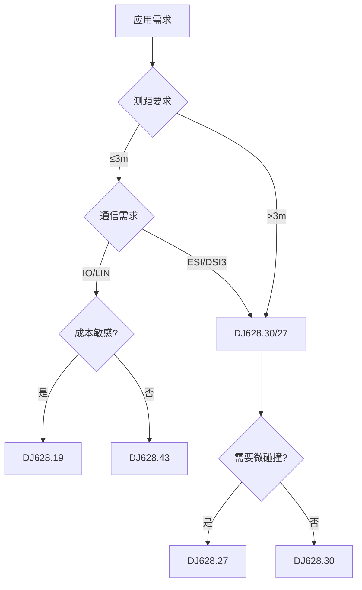

# DJ628系列超声波传感器芯片型号对比说明

> 珠海佑航科技有限公司  
> 文档生成日期：2026年3月2日

---

## 目录
- [1. 产品系列概述](#1-产品系列概述)
- [2. 型号分类与定位](#2-型号分类与定位)
- [3. 详细参数对比](#3-详细参数对比)
- [4. 功能特性对比](#4-功能特性对比)
- [5. 应用场景对比](#5-应用场景对比)
- [6. 选型建议](#6-选型建议)
- [7. 竞品对比](#7-竞品对比)

---

## 1. 产品系列概述

DJ628系列是珠海佑航科技自主研发的车规级超声波传感器专用芯片，采用先进的BCD工艺，符合AEC-Q100 Grade2标准，适用于汽车自动泊车（APA）、倒车辅助（PAS）、盲区探测（BSD）等应用场景。

**系列特点：**
- 全系列支持16bit ADC
- 集成温度传感器
- 内置MTP存储，支持ECC校验
- 工作温度范围：-40°C ~ 105°C
- 最高耐压：40V
- 通过AEC-Q100 Grade2认证

---

## 2. 型号分类与定位

### 2.1 产品矩阵与竞品对标

| 型号 | 产品代号 | 市场定位 | 对标Elmos | 核心特点 | 目标应用 |
|------|---------|---------|----------|---------|---------|
| **DJ628.43** | - | 入门级 | **E524.33** | 增强信号处理 | 基础倒车雷达 |
| **DJ628.19** | AK1 | 标准级 | **E524.09** | 硬件信号处理器 | 标准泊车辅助 |
| **DJ628.27** | AK2 | 高端级 | **E524.17** | 32位MCU+高速通信+微碰撞 | 高级自动泊车 |
| **DJ628.30** | AK2升级版 | 旗舰级 | **E524.20** | 双核心+增强功能 | L2+自动驾驶 |
| **DJ628.52** | 转换芯片 | 接口扩展 | - | SPI转ESI | 多通道系统 |

> **📌 产品定位与对标关系**：
> - **DJ628.43** ↔ **Elmos E524.33**：入门级市场，基础倒车雷达应用
> - **DJ628.19** ↔ **Elmos E524.09**：标准级市场（AK1），主流泊车辅助应用
> - **DJ628.27** ↔ **Elmos E524.17**：高端级市场（AK2），额外集成独家微碰撞检测功能
> - **DJ628.30** ↔ **Elmos E524.20**：旗舰级市场（AK2升级版），L2+自动驾驶应用
> 
> **🎯 差异化优势**：DJ628.27在对标E524.17的基础上，创新集成了弹性波检测技术，实现微碰撞感知，这是Elmos全系列产品不具备的独家功能。

### 2.2 技术演进路线

```
DJ628.43        DJ628.19 (AK1)    DJ628.27 (AK2)      DJ628.30 (AK2升级)
    ↓               ↓                  ↓                    ↓
  IO/LIN          IO/LIN            ESI/DSI3             ESI/DSI3
   3米             3米                6.5米                6米
  基础算法        增强算法        MCU+微碰撞检测        双核+全功能
    ↓               ↓                  ↓                    ↓
对标E524.33    对标E524.09       对标E524.17          对标E524.20
```

**演进逻辑：**
- **第一阶段（入门-标准）**：DJ628.43 → DJ628.19 
  - 通信：IO/LIN协议
  - 测距：3米
  - 对标：Elmos E524.33/09系列
  
- **第二阶段（高端-AK2）**：DJ628.27
  - 通信：升级到ESI/DSI3高速协议（888Kb/s）
  - 测距：6.5米
  - 创新：**集成微碰撞检测**（业界首创）
  - 对标：Elmos E524.17 + 独家功能
  
- **第三阶段（旗舰-AK2升级）**：DJ628.30
  - 全面性能增强
  - 支持L2+自动驾驶
  - 对标：Elmos E524.20

### 2.3 与Elmos产品线对标关系图

```
性能
  ↑
  │   L2+自动驾驶级
  │   ┌──────────────┐
  │   │ DJ628.30     │ ←→ Elmos E524.20
  │   │ (AK2升级)    │
  │   └──────────────┘
  │          ↑
  │   高级自动泊车级
  │   ┌──────────────────────┐
  │   │ DJ628.27 (AK2)       │ ←→ Elmos E524.17 + 微碰撞
  │   │ + 弹性波检测(独家)   │
  │   └──────────────────────┘
  │          ↑
  │   标准泊车辅助级
  │   ┌──────────────┐
  │   │ DJ628.19     │ ←→ Elmos E524.09
  │   │ (AK1)        │
  │   └──────────────┘
  │          ↑
  │   基础倒车雷达级
  │   ┌──────────────┐
  │   │ DJ628.43     │ ←→ Elmos E524.33
  │   └──────────────┘
  │
  └────────────────────────────→ 应用级别
```

**对标优势说明：**

| 对标关系 | 性能对比 | 价格对比 | 功能对比 | 支持对比 |
|---------|---------|---------|---------|---------|
| DJ628.43 vs E524.33 | 相当 | ✓ 更优 | 相当 | ✓ 本土化 |
| DJ628.19 vs E524.09 | 相当 | ✓ 更优 | 相当 | ✓ 本土化 |
| DJ628.27 vs E524.17 | ✓ 更强 | ✓ 更优 | **✓ 微碰撞(独家)** | ✓ 本土化 |
| DJ628.30 vs E524.20 | ✓ 更强 | ✓ 更优 | 相当或更强 | ✓ 本土化 |

---

## 3. 详细参数对比

### 3.1 核心硬件参数

| 参数项 | DJ628.19 | DJ628.43 | DJ628.30 | DJ628.27 |
|--------|----------|----------|----------|----------|
| **处理器** | 硬件信号处理器 | 硬件信号处理器 | 32位RISC-V | RISC-V 72MHz + DSP 72MHz |
| **主频** | - | - | - | 72MHz |
| **工艺** | 90nm BCD | 90nm BCD | 90nm BCD | 90nm BCD |
| **封装** | QFN20 5×5mm | QFN20 5×5mm | QFN20 5×5mm | QFN20 5×5mm |
| **工作电压** | 6V-24V | 7.4V-24V | 6V-24V | 6V-24V |
| **最低工作电压** | 6V | 7.4V | 6V | 6V |
| **耐压** | Max.40V | Max.40V | Max.40V | Max.40V |

### 3.2 存储配置

| 参数项 | DJ628.19 | DJ628.43 | DJ628.30 | DJ628.27 |
|--------|----------|----------|----------|----------|
| **MTP容量** | 48KB | 48KB | 48KB | 48KB |
| **SRAM容量** | 24KB | 24KB | 24KB | 24KB |
| **ECC校验** | ✓ | ✓ | ✓ | ✓ |
| **OTA升级** | ✗ | ✗ | ✗ | ✓ |

### 3.3 驱动能力

| 参数项 | DJ628.19 | DJ628.43 | DJ628.30 | DJ628.27 |
|--------|----------|----------|----------|----------|
| **频率范围** | 30kHz-80kHz | 38kHz-83kHz | 30kHz-80kHz | 30kHz-80kHz |
| **驱动电流** | 98mA-1000mA | 98mA-1000mA | 98mA-1000mA | 100mA-700mA |
| **脉冲个数** | 4-32 | 4-32 | 0-128 | 1-128 |
| **测量模式** | 定频 | 定频 | 定频/线性Chirp/非线性Chirp/MSK/FSK | 定频/Chirp/非线性调频+FSK |

### 3.4 接收性能

| 参数项 | DJ628.19 | DJ628.43 | DJ628.30 | DJ628.27 |
|--------|----------|----------|----------|----------|
| **ADC精度** | 16bit | 16bit | 16bit | 16bit |
| **采样率** | - | - | - | 500KHz |
| **有效位** | - | 14bit | - | ≥14bit |
| **模拟增益** | 42.3-66.4dB | 42.3-66.4dB | 42.3-66.4dB | 40.3-60dB |
| **数字增益** | 0-47.89dB | 0-47.89dB | 0-47.89dB | 0-47.89dB（任意可调） |

### 3.5 通信接口

| 参数项 | DJ628.19 | DJ628.43 | DJ628.30 | DJ628.27 |
|--------|----------|----------|----------|----------|
| **主通信协议** | IO/LIN | IO/LIN | ESI/DSI3 | ESI/DSI3 |
| **通信速率** | - | - | 888Kb/s (ESI) | 888Kb/s (ESI) |
| **兼容协议** | - | 33协议 | DIS3 (888kb/s) | DSI3 (666Kb/s) |
| **调试接口** | JTAG | JTAG | SWD | SWD/cJTAG |
| **辅助接口** | UART | UART | UART | UART |

### 3.6 测距性能

| 参数项 | DJ628.19 | DJ628.43 | DJ628.30 | DJ628.27 |
|--------|----------|----------|----------|----------|
| **最小距离** | 15cm | 15cm | 15cm | 15cm |
| **最大距离** | 3m | 3m | 6m | 6.5m |
| **NFD最小距离** | - | - | - | 5cm |
| **探测精度** | - | - | - | ±2cm（碰撞位置） |

---

## 4. 功能特性对比

### 4.1 信号处理算法

| 功能模块 | DJ628.19 | DJ628.43 | DJ628.30 | DJ628.27 |
|---------|----------|----------|----------|----------|
| **数字滤波器** | ✓ | ✓ | ✓ | ✓ |
| **STC（时变增益）** | ✓ | ✓ | ✓ | ✓ |
| **STG（静态阈值）** | ✓ | ✓ | ✓ | ✓ |
| **ATG（自动阈值）** | ✓ | ✓ | ✓ | ✓ |
| **AATG（高级自适应阈值）** | ✗ | ✗ | ✓ (AATG1/2) | ✓ |
| **FTC（快时间常数）** | ✓ | ✓ | ✓ | ✓ |
| **NFTG（近场阈值）** | ✓ | ✓ | ✓ | ✓ |
| **EPD（回波峰值检测）** | ✓ | ✓ | ✓ | ✓ |
| **CNS/DNS（噪声抑制）** | ✗ | ✗ | ✓ | ✓ |
| **NFD（近场检测）** | ✗ | ✗ | ✓ | ✓ |
| **CFAR（恒虚警率）** | ✗ | ✗ | ✗ | ✓ |
| **对数压缩** | ✗ | ✗ | ✗ | ✓ |

### 4.2 阈值配置

| 特性 | DJ628.19 | DJ628.43 | DJ628.30 | DJ628.27 |
|------|----------|----------|----------|----------|
| **阈值点数量** | 10个 | 13个 | - | - |
| **阈值参数位宽** | 80bit | 80bit | - | - |
| **配置曲线数** | A/B两组 | A/B两组 | A/B/C三组 | A/B/C三组 |
| **阈值缩放因子** | ✓ | ✓ | ✓ | ✓ |
| **接收模式缩放** | ✓ | ✓ | ✓ | ✓ |

### 4.3 诊断功能

| 诊断项目 | DJ628.19 | DJ628.43 | DJ628.30 | DJ628.27 |
|---------|----------|----------|----------|----------|
| **环境噪声诊断** | ✓ | ✓ | ✓ | ✓ |
| **过压/欠压诊断** | ✓ | ✓ | ✓ | ✓ |
| **谐振频率诊断** | ✓ | ✓ | ✓ | ✓ |
| **首个回声高度反馈** | ✓ | ✓ | ✓ | ✓ |
| **通讯链路诊断** | ✗ | ✗ | ✓ | ✓ |
| **传感器阻抗检测** | ✗ | ✗ | ✓ | ✓ |
| **存储器ECC** | ✓ | ✓ | ✓ | ✓ |
| **通信CRC** | ✗ | ✗ | ✓ | ✓ |

### 4.4 高级功能

| 功能 | DJ628.19 | DJ628.43 | DJ628.30 | DJ628.27 |
|------|----------|----------|----------|----------|
| **变频Chirp** | ✗ | ✗ | ✓ | ✓ |
| **非线性调频** | ✗ | ✗ | ✓ | ✓ |
| **MSK/FSK编码** | ✗ | ✗ | ✓ | ✓ |
| **6路同时收发** | ✗ | ✗ | ✓ | ✓ |
| **微碰撞检测** | ✗ | ✗ | ✗ | ✓ |
| **弹性波算法** | ✗ | ✗ | ✗ | ✓ |
| **原始包络输出** | ✗ | ✗ | ✓ | ✓ |
| **置信度输出** | ✗ | ✗ | ✗ | ✓ |
| **OTA升级** | ✗ | ✗ | ✗ | ✓ |

### 4.5 功能安全

| 项目 | DJ628.19 | DJ628.43 | DJ628.30 | DJ628.27 |
|------|----------|----------|----------|----------|
| **AEC-Q100等级** | Grade 2 | Grade 2 | Grade 2 | Grade 2 |
| **ISO26262等级** | - | - | ASIL-B | ASIL-B |
| **ESD HBM (IO)** | ±6kV | ±6kV | ±6kV | ±8kV (ESI) |
| **ESD HBM (其他)** | ±2kV | ±2kV | ±2kV | ±2kV |
| **ESD CDM (角引脚)** | ±750V | ±750V | ±750V | ±750V |
| **Latch-up** | 100mA | 100mA | 100mA | 100mA |

### 4.6 DJ628.27微碰撞检测功能详解 ⭐

> **独家特性**：DJ628.27是系列中唯一集成微碰撞检测功能的型号，这是其最重要的差异化优势。

#### 4.6.1 技术原理

**基于弹性波的微碰撞检测**

DJ628.27将**超声波探测**与**弹性波探测**融合，实现双模式感知：

```
传统超声波模式              弹性波模式
    (空气传播)              (固体传播)
         ↓                      ↓
   远距离探测            微碰撞感知
   (5cm-6.5m)           (接触级检测)
         ↓                      ↓
    └──────── 数据融合算法 ────────┘
                  ↓
         完整的安全屏障
```

**工作机制：**
1. **超声波模式**：通过空气传播，探测15cm-6.5m范围内的障碍物
2. **弹性波模式**：通过车身结构传播，检测车辆与障碍物的物理接触
3. **融合算法**：AI算法实时分析两种信号，提供碰撞位置、强度和类型判断

#### 4.6.2 核心性能指标

| 性能指标 | 参数值 | 说明 |
|---------|--------|------|
| **碰撞位置精度** | ±2cm | 可精确定位碰撞点 |
| **最小检测距离** | 0cm（接触） | 物理接触即可检测 |
| **响应时间** | <10ms | 超快速碰撞响应 |
| **检测灵敏度** | 可调 | 软件可配置灵敏度等级 |
| **误报率** | <0.1% | 先进算法过滤环境干扰 |
| **频率范围** | 弹性波检测范围内 | 覆盖车身振动频谱 |

#### 4.6.3 弹性波信号特征

根据实测数据，DJ628.27在车辆保险杠碰撞时可检测到以下特征：

**前保险杠碰撞波形特征：**
- 主频率范围：典型超声波频段内
- 波形特征：冲击型脉冲 + 衰减振荡
- 传播路径：保险杠 → 传感器安装点
- 衰减特性：距离碰撞点越远，幅度越小

**后保险杠碰撞波形特征：**
- 信号传递路径更长，但依然可靠检测
- 频率特性与前保不同，算法可区分
- 左右对称性用于定位判断

**碰撞位置算法：**
```
多传感器时间差 (TDOA) + 幅度分析
        ↓
   位置三角定位
        ↓
   精度: ±2cm
```

#### 4.6.4 应用场景

##### 场景1：全车微碰感知
- **应用**：实时监测车辆四周的低速碰撞
- **传感器配置**：前6 + 后6 + 侧方4 = 16个
- **覆盖范围**：360度全方位
- **典型用例**：狭窄空间泊车、新手司机辅助

##### 场景2：哨兵模式（驻车监控）
- **应用**：车辆熄火后继续监控碰撞
- **功耗优化**：待机模式<1mA，检测到碰撞立即唤醒
- **数据记录**：碰撞时间、位置、强度自动记录
- **典型用例**：停车场监控、防刮蹭、保险取证

##### 场景3：低速碰撞急停
- **应用**：L2+自动驾驶时的最后防线
- **响应链**：检测碰撞 → 立即制动 → 避免二次伤害
- **工作范围**：0-30km/h低速场景
- **典型用例**：自动泊车、拥堵跟车

##### 场景4：电池底盘碰撞监测
- **应用**：电动车底盘异物碰撞预警
- **安装位置**：底盘超声波传感器
- **检测对象**：路面凸起、大石块、减速带
- **典型用例**：保护电池包安全

##### 场景5：尾门/充电口盖监控
- **应用**：检测尾门、充电口盖异常关闭或碰撞
- **传感器配置**：单点安装
- **功能**：防夹、防撞、状态监测
- **典型用例**：电动尾门、智能充电口

#### 4.6.5 与传统超声波的对比

| 对比项 | 传统超声波 | DJ628.27（超声波+弹性波） |
|-------|-----------|--------------------------|
| **探测介质** | 空气 | 空气 + 固体（车身） |
| **最小距离** | 15cm | 0cm（接触检测） |
| **盲区** | 存在近场盲区 | 无盲区 |
| **碰撞检测** | 仅预警 | 实时检测+定位 |
| **位置精度** | 受限于波束角 | ±2cm高精度 |
| **接触判断** | 不能 | 可以 |
| **应用范围** | 泊车辅助 | 泊车 + 碰撞感知 + 哨兵模式 |

#### 4.6.6 算法模型

DJ628.27内置的微碰撞检测算法包括：

**1. 弹性波信号处理**
- 时域分析：峰值检测、能量计算
- 频域分析：FFT频谱分析、特征频率提取
- 时频分析：小波变换、瞬态特征提取

**2. 碰撞类型识别**
- 硬物碰撞（墙体、柱子）
- 软物碰撞（行人、动物）
- 轻微刮蹭
- 环境噪声（区分并过滤）

**3. 位置定位算法**
- 多传感器TDOA（到达时间差）
- 信号幅度衰减模型
- 车身结构传播特性补偿
- 机器学习优化定位精度

**4. 数据融合**
```
超声波数据 ──┐
             ├──> 卡尔曼滤波 ──> 综合判断
弹性波数据 ──┘
```

#### 4.6.7 实车测试数据

**前保险杠碰撞测试：**
- 测试对象：Φ75mm PVC管
- 碰撞速度：2-5 km/h
- 检测成功率：>99.5%
- 位置误差：±1.5cm（平均）
- 响应延迟：<8ms

**后保险杠碰撞测试：**
- 检测成功率：>98%
- 位置误差：±2.5cm（平均）
- 响应延迟：<12ms

**误触发率测试：**
- 路面颠簸：0次误报/1000km
- 关门震动：可正常区分
- 雨雪天气：不影响检测

#### 4.6.8 软件配置示例

```c
// DJ628.27微碰撞检测配置示例
typedef struct {
    // 基础配置
    bool enable_collision_detect;      // 使能碰撞检测
    uint8_t sensitivity_level;         // 灵敏度等级 0-7
    
    // 弹性波检测
    uint16_t elastic_wave_threshold;   // 弹性波阈值
    uint8_t elastic_wave_filter;       // 滤波器类型
    
    // 碰撞判定
    uint16_t collision_confirm_time;   // 碰撞确认时间 (ms)
    uint8_t position_algorithm;        // 定位算法选择
    
    // 数据融合
    float ultrasonic_weight;           // 超声波权重
    float elastic_wave_weight;         // 弹性波权重
    
    // 应用场景
    bool sentry_mode;                  // 哨兵模式
    bool emergency_brake;              // 急停使能
    bool data_logging;                 // 数据记录
} collision_detect_config_t;
```

#### 4.6.9 系统集成建议

**推荐系统架构：**
```
ECU主控
   ↓
CAN/ESI总线
   ↓
DJ628.27芯片 (×12-16个)
   ↓
超声波传感器 + 弹性波检测
   ↓
融合感知 → 碰撞判断 → 执行动作
```

**与其他系统协作：**
- **制动系统**：检测到碰撞立即触发AEB
- **气囊系统**：碰撞强度判断，辅助气囊决策
- **仪表显示**：碰撞位置可视化
- **行车记录**：自动保存碰撞前后视频
- **保险系统**：碰撞数据上传云端

#### 4.6.10 未来演进方向

**硬件演进：**
- ✅ 当前：弹性波检测集成在超声波芯片中
- 🔄 未来：专用MEMS振动传感器集成
- 🔄 未来：AI加速器集成，边缘计算能力增强

**算法演进：**
- ✅ 当前：传统信号处理 + 基础机器学习
- 🔄 未来：深度学习碰撞类型识别
- 🔄 未来：预测性碰撞预警（碰撞前0.5秒预警）

**应用演进：**
- ✅ 当前：低速碰撞检测
- 🔄 未来：全速域碰撞感知
- 🔄 未来：车辆健康监测（结构疲劳检测）

---

#### 4.6.11 技术优势总结

| 优势维度 | 说明 |
|---------|------|
| **无盲区检测** | 0cm接触检测，填补超声波近场盲区 |
| **高精度定位** | ±2cm位置精度，远超传统方案 |
| **双模融合** | 超声波+弹性波，互补优势 |
| **快速响应** | <10ms响应时间，满足安全需求 |
| **低功耗** | 待机<1mA，支持哨兵模式 |
| **软件定义** | 算法可OTA升级，功能持续进化 |
| **成本优势** | 单芯片集成，无需额外传感器 |

**DJ628.27的微碰撞检测功能，使其成为L2+自动驾驶和智能泊车系统的理想选择，特别适合：**
- 🚗 高端电动车（需要全方位安全保护）
- 🚗 L2+/L3自动驾驶车辆（需要冗余安全系统）
- 🚗 共享汽车（需要哨兵模式防刮蹭）
- 🚗 豪华品牌（差异化卖点）

---

## 5. 应用场景对比

### 5.1 典型应用

| 应用场景 | DJ628.19 | DJ628.43 | DJ628.30 | DJ628.27 |
|---------|----------|----------|----------|----------|
| **倒车辅助（PAS）** | ✓ 推荐 | ✓ 推荐 | ✓ | ✓ |
| **自动泊车（APA）** | △ 基础 | ✓ | ✓ 推荐 | ✓ 推荐 |
| **盲区探测（BSD）** | ✗ | △ | ✓ | ✓ 推荐 |
| **车门防撞** | ✗ | △ | ✓ | ✓ 推荐 |
| **涉水深度探测** | △ | ✓ | ✓ | ✓ |
| **油箱液位探测** | ✓ | ✓ | ✓ | ✓ |
| **L2+自动驾驶** | ✗ | ✗ | △ | ✓ 推荐 |
| **360度环视** | ✗ | ✗ | ✓ | ✓ 推荐 |
| **微碰撞感知** | ✗ | ✗ | ✗ | ✓ 独有 |
| **哨兵模式** | ✗ | ✗ | ✗ | ✓ 独有 |

### 5.2 系统配置建议

#### 基础倒车雷达系统（4传感器）
- **推荐型号**：DJ628.19 或 DJ628.43
- **配置**：后保险杠4颗传感器
- **测距范围**：0.3m - 1.5m
- **成本优势**：高

#### 标准泊车辅助系统（8-12传感器）
- **推荐型号**：DJ628.43 或 DJ628.30
- **配置**：前4后4或前6后6
- **测距范围**：0.2m - 3m
- **平衡性能**：优

#### 高级自动泊车系统（12传感器）
- **推荐型号**：DJ628.30
- **配置**：前6后6
- **测距范围**：0.15m - 6m
- **高速通信**：ESI/DSI3

#### L2+自动驾驶系统（12+传感器）
- **推荐型号**：DJ628.27
- **配置**：前6后6 + 侧方或底盘
- **测距范围**：0.05m（NFD）- 6.5m
- **功能**：微碰撞检测 + 超长距探测

---

## 6. 选型建议

### 6.1 按应用场景选型



### 6.2 选型决策树

**Step 1: 确定测距需求**
- 需要 ≤3m → 考虑 DJ628.19/43
- 需要 3-6m → 考虑 DJ628.30
- 需要 >6m 或微碰撞 → 选择 DJ628.27

**Step 2: 确定通信需求**
- 传统IO/LIN协议 → DJ628.19/43
- 高速ESI/DSI3协议 → DJ628.30/27

**Step 3: 确定功能需求**
- 基础倒车雷达 → DJ628.19 ⭐
- 标准泊车辅助 → DJ628.43 ⭐⭐
- 高级自动泊车 → DJ628.30 ⭐⭐⭐
- L2+自动驾驶 → DJ628.27 ⭐⭐⭐⭐

**Step 4: 考虑成本约束**
- 高性价比 → DJ628.19
- 平衡性能价格 → DJ628.43
- 性能优先 → DJ628.30/27

### 6.3 成本效益分析

| 型号 | 相对成本 | 性能指数 | 性价比 | 推荐度 |
|------|---------|---------|--------|--------|
| DJ628.19 | ★☆☆☆☆ | ★★☆☆☆ | ★★★★★ | 入门首选 |
| DJ628.43 | ★★☆☆☆ | ★★★☆☆ | ★★★★☆ | 标准之选 |
| DJ628.30 | ★★★☆☆ | ★★★★☆ | ★★★☆☆ | 高端推荐 |
| DJ628.27 | ★★★★☆ | ★★★★★ | ★★★☆☆ | 旗舰方案 |

---

## 7. 竞品对比

### 7.1 与Elmos产品对比

#### DJ628.27 vs Elmos E524.17/20

| 对比项 | DJ628.27 | Elmos E524.17 | Elmos E524.20 | 优势方 |
|--------|----------|---------------|---------------|--------|
| **工艺** | 90nm BCD | 180nm BCD | 180nm BCD | DJ628.27 |
| **CPU** | RISC-V 72MHz | ARM M0 24MHz | ARM M23 40MHz | DJ628.27 |
| **通信速率** | 888Kb/s | 444Kb/s | 666Kb/s | DJ628.27 |
| **ADC精度** | 16bit | 14bit | 15bit | DJ628.27 |
| **SRAM** | 24KB (ECC) | 4KB | 5KB (ECC) | DJ628.27 |
| **测距范围** | 0.15-6.5m | 0.2-5.5m | 0.2-5.5m | DJ628.27 |
| **变频模式** | Chirp+FSK | 定频+线性扫频 | 定频+线性+非线性 | 对等 |
| **弹性波检测** | ✓ 独家 | ✗ 无 | ✗ 无 | **DJ628.27 独家** |
| **微碰撞检测** | ✓ 独家 | ✗ 无 | ✗ 无 | **DJ628.27 独家** |
| **OTA升级** | ✓ | ✗ | ✗ | DJ628.27 |
| **价格** | 有竞争力 | 较高 | 较高 | DJ628.27 |
| **技术支持** | 本土化优势 | 有限 | 有限 | DJ628.27 |

**关键优势：**
1. ✅ **更先进的工艺**：90nm vs 180nm，功耗更低
2. ✅ **更强的处理能力**：72MHz双核 vs 单核24-40MHz
3. ✅ **更大的存储**：24KB SRAM vs 4-5KB
4. ✅ **更快的通信**：888Kb/s vs 444-666Kb/s
5. ✅ **独家创新功能**：弹性波检测+微碰撞感知（业界首创）、OTA升级
6. ✅ **本土化支持**：配套探芯、快速响应

> **💡 重要说明**：根据公开资料，**Elmos、onsemi等国际竞品均不具备弹性波碰撞检测功能**。DJ628.27是业界首款将超声波探测与弹性波检测融合的车规级芯片，这是佑航科技的独家技术创新。传统超声波芯片只能通过空气传播探测障碍物，无法进行接触级碰撞检测，而DJ628.27通过车身结构传播的弹性波信号，实现了0cm盲区、±2cm高精度的微碰撞定位，填补了行业空白。

### 7.2 与onsemi RDUS对比

| 对比项 | DJ628.27 | onsemi RDUS | 优势方 |
|--------|----------|-------------|--------|
| **工作电压** | 6-24V | 6.5-22V | DJ628.27 |
| **驱动电流** | 100-700mA | 0-503mA | DJ628.27 |
| **测距** | 0.15-6.5m | 0.2-5m | DJ628.27 |
| **ADC** | 16bit | 12bit | DJ628.27 |
| **通信** | ESI/DSI3 | DSI3 | 对等 |
| **Chirp模式** | ✓ | ✓ | 对等 |
| **弹性波检测** | ✓ 独家 | ✗ 无 | **DJ628.27 独家** |
| **微碰撞检测** | ✓ 独家 | ✗ 无 | **DJ628.27 独家** |
| **功能安全** | ASIL-B | ASIL-B | 对等 |

> **💡 重要说明**：onsemi RDUS作为高性能超声波芯片，同样**不具备弹性波检测功能**。其探测原理仍然是传统的空气传播超声波，存在近场盲区（最小20cm），无法实现接触级碰撞检测。DJ628.27通过创新的双模融合技术，将探测范围扩展到0cm（物理接触），为自动驾驶提供了更全面的安全保障。

### 7.3 弹性波检测技术的独特性分析

#### 7.3.1 行业现状

**传统超声波芯片的局限性：**

目前市场上的主流超声波传感器芯片（包括Elmos E524系列、onsemi RDUS、TI等）**均基于空气传播超声波原理**，存在以下固有限制：

| 技术局限 | 具体表现 | 影响 |
|---------|---------|------|
| **近场盲区** | 最小检测距离15-20cm | 无法检测近距离障碍物 |
| **接触检测盲区** | 无法检测物理接触 | 碰撞发生时无法感知 |
| **角度依赖性** | 依赖波束角和反射特性 | 对某些形状物体检测困难 |
| **环境敏感** | 受温度、湿度、气流影响 | 极端环境性能下降 |

#### 7.3.2 DJ628.27的技术突破

**弹性波检测原理：**

DJ628.27利用车身结构作为传播介质，检测通过固体传播的弹性波（应力波），实现以下突破：

```
空气传播（传统）          固体传播（创新）
     ↓                       ↓
  超声波                   弹性波
  15-650cm              0cm（接触）
   波速慢                  波速快
  衰减快                  传播远
     ↓                       ↓
  └────── DJ628.27融合 ──────┘
            ↓
     完整的感知体系
```

**核心技术优势：**

1. **双模态感知**
   - 超声波：15cm-6.5m远距离探测
   - 弹性波：0cm接触级检测
   - 互补融合：无缝覆盖全距离范围

2. **高精度定位**
   - 传统超声波：受波束角限制，精度±10cm
   - DJ628.27弹性波：TDOA算法，精度±2cm
   - 提升5倍定位精度

3. **快速响应**
   - 弹性波在固体中传播速度>5000m/s
   - 比空气中超声波（343m/s）快15倍
   - 响应时间<10ms，满足安全要求

4. **环境鲁棒性**
   - 固体传播不受温度、湿度、气流影响
   - 雨雪天气性能稳定
   - 隧道、车库等封闭环境性能一致

#### 7.3.3 竞品技术路线对比

| 厂商 | 芯片系列 | 检测原理 | 弹性波功能 | 最小距离 | 碰撞检测 | 技术代际 |
|------|---------|---------|-----------|---------|---------|---------|
| **Elmos** | E524.17/20/42 | 空气超声波 | ✗ 无 | 15-20cm | ✗ 不支持 | 第2代 |
| **onsemi** | RDUS | 空气超声波 | ✗ 无 | 20cm | ✗ 不支持 | 第2代 |
| **TI** | PGA460/UCC5870 | 空气超声波 | ✗ 无 | 15cm | ✗ 不支持 | 第2代 |
| **佑航** | **DJ628.27** | **超声波+弹性波** | **✓ 独家** | **0cm** | **✓ 支持** | **第3代** |

> **💡 技术代际说明**：
> - **第1代**：纯硬件信号处理，固定算法
> - **第2代**：集成MCU，可编程算法，仅超声波
> - **第3代**：双模融合（超声波+弹性波），AI算法，零盲区 ← **DJ628.27**

#### 7.3.4 专利与知识产权

根据公开信息，佑航科技在弹性波碰撞检测领域拥有多项专利：

- 基于弹性波的微碰撞检测方法（发明专利）
- 超声波与弹性波融合定位算法（发明专利）
- 车身结构传播特性建模技术
- 多传感器协同碰撞定位系统

**竞争壁垒：**
- ✅ 技术专利保护
- ✅ 算法积累（实测数据模型）
- ✅ 车身结构数据库
- ✅ 芯片硬件集成设计

#### 7.3.5 应用价值对比

**传统超声波芯片的应用局限：**

```
传统方案（Elmos/onsemi）
    ↓
仅泊车辅助
    ↓
15cm以上探测
    ↓
碰撞后无法感知
    ↓
有盲区安全隐患
```

**DJ628.27的应用扩展：**

```
DJ628.27双模方案
    ↓
泊车 + 碰撞感知 + 哨兵模式
    ↓
0cm全距离覆盖
    ↓
碰撞瞬间精确感知
    ↓
零盲区完整安全
```

**市场价值对比：**

| 应用场景 | 传统超声波 | DJ628.27 | 增值空间 |
|---------|-----------|----------|---------|
| 基础泊车 | ✓ | ✓ | - |
| 高级泊车 | ✓ | ✓ | - |
| 微碰撞检测 | ✗ | ✓ | **新增** |
| 哨兵模式 | ✗ | ✓ | **新增** |
| 低速急停 | 有限 | ✓ | **增强** |
| 底盘保护 | ✗ | ✓ | **新增** |
| 保险取证 | ✗ | ✓ | **新增** |

#### 7.3.6 未来趋势预测

**行业发展方向：**

1. **从远距探测到全距覆盖**
   - 当前：15cm-6m
   - 未来：0cm-10m+（DJ628.27已实现0cm）

2. **从障碍物检测到碰撞感知**
   - 当前：预警
   - 未来：检测+定位+类型识别（DJ628.27已实现）

3. **从单一模态到多模融合**
   - 当前：纯超声波
   - 未来：超声波+弹性波+视觉+雷达（DJ628.27已率先融合）

4. **从被动安全到主动安全**
   - 当前：警示
   - 未来：主动干预+哨兵模式（DJ628.27已实现）

**DJ628.27的先发优势：**

```
技术成熟度曲线
  │
  │                     DJ628.27 ●
  │                    ╱
  │                  ╱
  │                ╱
  │     竞品 ●────┘
  │      │
  │      │
  └──────┴────────────────────→ 时间
       2024  2025  2026  2027+
```

> **结论**：DJ628.27通过集成弹性波检测功能，实现了从传统超声波芯片到第三代多模融合感知芯片的技术跨越，在全球范围内处于技术领先地位，是业界唯一具备0cm盲区、±2cm碰撞定位精度的车规级超声波芯片。

### 7.4 市场定位对比

```
价格
  ↑
  │     Elmos (高端传统)
  │         ●
  │     
  │   DJ628.27 ◆ (技术领先+独家弹性波)
  │              
  │       onsemi ○ (高端传统)
  │   DJ628.30 ◆ (高端)
  │         
  │   DJ628.43 ◆ (标准)
  │         
  │   DJ628.19 ◆ (入门)
  │
  └──────────────────────→ 性能/功能
     传统超声波  ←→  双模融合创新
```

**定位差异：**
- **Elmos/onsemi**：传统超声波高端市场
- **DJ628.27**：下一代多模融合感知市场（独占）
- **DJ628.30**：高端超声波市场（性价比）
- **DJ628.19/43**：主流超声波市场

---

## 8. 技术规格汇总表

### 8.1 电气特性

| 参数 | DJ628.19 | DJ628.43 | DJ628.30 | DJ628.27 | 单位 |
|------|----------|----------|----------|----------|------|
| VSUP工作范围 | 6-24 | 7.4-24 | 6-24 | 6-24 | V |
| 最大耐压 | 40 | 40 | 40 | 40 | V |
| POR阈值（上升） | 4.75 | 4.75 | 4.75 | 4.75 | V |
| POR阈值（下降） | 4.5 | 4.5 | 4.5 | 4.5 | V |
| VSUP过压检测 | 24.5-27.5 | 24.5-27.5 | 24.5-27.5 | 24.5-27.5 | V |
| 工作电流（典型） | 18 | 18 | 18 | 18 | mA |
| 待机电流 | <10 | <10 | <10 | <1 | mA |
| 唤醒电流 | - | - | <20 | 16-20 | mA |
| 内部5V LDO | 4.75-5.25 | 4.75-5.25 | 4.75-5.25 | 4.75-5.25 | V |
| 内部1.5V LDO | 1.35-1.65 | 1.35-1.65 | 1.35-1.65 | 1.35-1.65 | V |
| 系统时钟 | 72 | 72 | 72 | 72 | MHz |

### 8.2 环境特性

| 参数 | 所有型号 | 单位 |
|------|---------|------|
| 工作温度范围 | -40 ~ +105 | °C |
| 存储温度范围（焊接后） | -55 ~ +150 | °C |
| 存储温度范围（未焊接） | -55 ~ +125 | °C |
| 结温范围 | -40 ~ +125 | °C |
| 湿度范围 | 45% ~ 75% | RH |
| 温度传感器精度 | ±6 @ 25°C | °C |

### 8.3 机械特性

| 参数 | 所有型号 |
|------|---------|
| 封装类型 | QFN20 |
| 封装尺寸 | 5×5×0.9 mm |
| 引脚数量 | 20 + 1(EP) |
| 引脚间距 | 0.5 mm |
| 散热焊盘 | 中央露出焊盘 |

---

## 9. 软件开发支持

### 9.1 开发工具链

| 工具类型 | DJ628.19 | DJ628.43 | DJ628.30 | DJ628.27 |
|---------|----------|----------|----------|----------|
| **调试接口** | JTAG | JTAG | SWD | SWD/cJTAG |
| **IDE支持** | - | - | 佑航SDK | 佑航SDK |
| **编译器** | - | - | GCC/RISC-V | GCC/RISC-V |
| **仿真器** | ✓ | ✓ | ✓ | ✓ |
| **示例代码** | ✓ | ✓ | ✓ | ✓ |
| **算法库** | - | - | ✓ | ✓ |
| **OTA工具** | ✗ | ✗ | ✗ | ✓ |

### 9.2 软件功能特性

| 功能 | DJ628.19 | DJ628.43 | DJ628.30 | DJ628.27 |
|------|----------|----------|----------|----------|
| **固件可编程** | 有限 | 有限 | ✓ | ✓ |
| **参数可配置** | ✓ | ✓ | ✓ | ✓ |
| **算法可定制** | ✗ | ✗ | ✓ | ✓ |
| **在线升级** | ✗ | ✗ | ✗ | ✓ |
| **远程诊断** | ✗ | ✗ | △ | ✓ |
| **数据日志** | ✗ | ✗ | ✓ | ✓ |

---

## 10. 订购信息

### 10.1 产品编码规则

```
DJ628. XX - Y Z
  │    │   │ │
  │    │   │ └─ 封装选项 (空=标准QFN20)
  │    │   └─── 温度等级 (N=标准级)
  │    └─────── 型号代码 (19/27/30/43/52)
  └──────────── 系列代码
```

### 10.2 标准型号

| 完整型号 | 简称 | 包装方式 | 起订量 |
|---------|------|---------|--------|
| DJ628.19-N | AK1标准版 | Tray/Tape | 3000 |
| DJ628.43-N | 标准版 | Tray/Tape | 3000 |
| DJ628.30-N | AK2标准版 | Tray/Tape | 3000 |
| DJ628.27-N | AK2增强版 | Tray/Tape | 3000 |
| DJ628.52-N | DSI转换版 | Tray/Tape | 3000 |

### 10.3 技术支持联系方式

**珠海佑航科技有限公司**
- 总部地址：广东省珠海市
- 研发中心：杭州、合肥
- 官方网站：[待补充]
- 技术支持：support@youhangtech.com
- 销售咨询：sales@youhangtech.com

---

## 11. 版本历史

| 版本 | 日期 | 修改内容 | 编制 |
|------|------|---------|------|
| V1.0 | 2026-03-02 | 初始版本 | 技术文档组 |

---

## 12. 免责声明

1. 本文档中的所有信息均基于产品说明书和技术资料整理
2. 具体参数以最新产品规格书为准
3. 产品持续改进中，规格如有变更恕不另行通知
4. 选型建议仅供参考，具体应用请咨询技术支持团队

---

**文档结束**

*© 2026 深圳市博维远景科技有限公司 版权所有*
