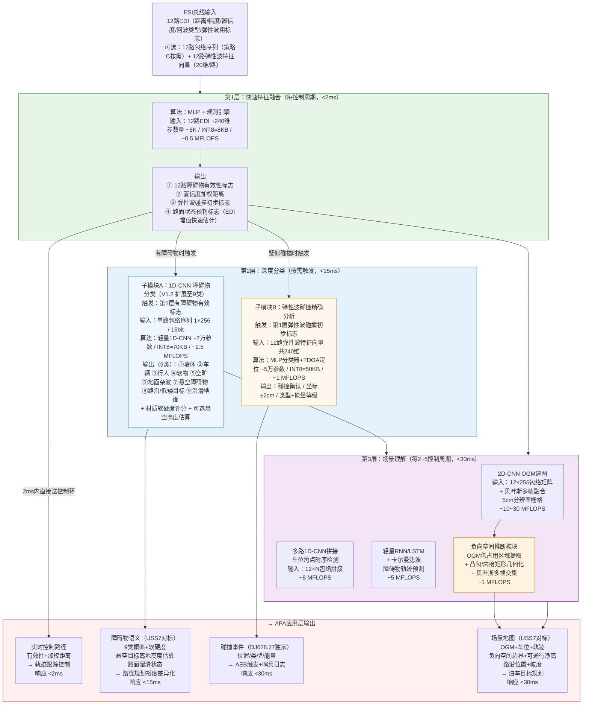
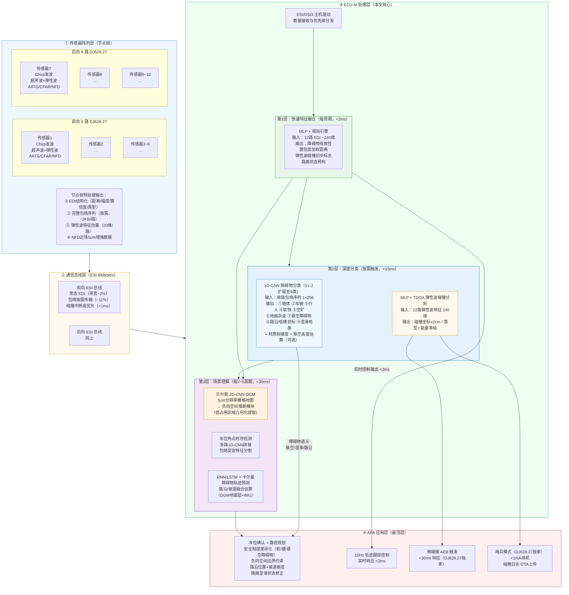

# 基于佑航 AK2（DJ628.27）芯片的 ECU 侧 AI 算法处理可行性分析

> **文档版本**：V1.2  
> **编制日期**：2026年5月9日  
> **编制依据**：
> - 珠海佑航科技 DJ628.27 产品说明书 V1.2
> - 珠海佑航科技 DJ628.30 产品说明书 V1.2
> - DJ628 系列超声波传感器芯片型号对比说明（2026年3月2日）
> - AK1 与 AK2 系统差异分析 V1.2
> - BOSCH USS7 产品功能介绍（2026年5月，用于对标补充）

---

## 目录

- [1. 分析背景与目标](#1-分析背景与目标)
- [2. DJ628.27 芯片能力概要（节点侧）](#2-dj62827-芯片能力概要节点侧)
- [3. ECU侧可用输入数据分析](#3-ecu侧可用输入数据分析)
- [4. ECU侧AI算法适配分析](#4-ecu侧ai算法适配分析)
- [5. 典型AI应用场景可行性分析](#5-典型ai应用场景可行性分析)
  - [5.1 场景A：障碍物类型识别](#51-场景a障碍物类型识别高优先级)
  - [5.2 场景B：车位精准识别](#52-场景b车位精准识别高优先级)
  - [5.3 场景C：微碰撞感知](#53-场景c微碰撞感知独家dj62827专有)
  - [5.4 场景D：OGM占用栅格地图](#54-场景dogm占用栅格地图ai精细建图)
  - [5.5 场景E：哨兵模式AI驻守](#55-场景e哨兵模式下的ai驻守dj62827独家)
  - [5.6 场景F：悬空障碍物探测（对标BOSCH USS7）](#56-场景f悬空障碍物探测对标bosch-uss7)
  - [5.7 场景G：负向空间探测（对标BOSCH USS7首推能力）](#57-场景g负向空间探测对标bosch-uss7首推能力)
  - [5.8 场景H：湿滑路面检测（对标BOSCH USS7）](#58-场景h湿滑路面检测对标bosch-uss7)
  - [5.9 场景I：路沿与坡道探测（对标BOSCH USS7）](#59-场景i路沿与坡道探测对标bosch-uss7)
  - [5.10 应用场景可行性汇总](#510-应用场景可行性汇总)
- [6. 实时性与计算资源评估](#6-实时性与计算资源评估)
- [7. 系统架构设计建议](#7-系统架构设计建议)
- [8. 可行性结论与风险评估](#8-可行性结论与风险评估)

---

## 1. 分析背景与目标

### 1.1 分析背景

传统 AK1 超声波泊车系统（基于 Elmos E524.09）受限于以下三点，ECU 侧算法能力严重不足：

1. **数据维度极低**：传感器节点仅上报回波飞行时间（距离）和峰值幅度，无包络数据
2. **系统刷新率低**：串行轮询，12路约600ms/轮（~1.7Hz），无法支撑实时AI推理
3. **通信带宽瓶颈**：IO总线约6.7kbit/s，无法传输包络序列等高维数据

> **补充说明：回波距离/峰值幅度 与 包络数据 的本质区别，以及 AK1 不上传包络数据的原因**
>
> **① 什么是包络数据？**
>
> 超声波传感器发出一次脉冲后，压电换能器切换至接收模式，持续采集一段时间内（通常50ms，对应约8.5m探测深度）的回波信号。将该时间段内每个采样点的信号幅值按时间顺序排列，即得到**回波包络序列**（Envelope Sequence）。以500kHz采样率为例，50ms窗口内约有25,000个采样点，实际经抽取处理后约保留1,000个有效采样点，数据量约2KB。包络序列完整地记录了"哪个时刻、有多强的回波"，是一条随时间变化的幅值曲线。
>
> **② 回波距离和峰值幅度是什么？**
>
> - **回波飞行时间（距离）**：从包络序列中提取出最显著回波峰值对应的时间戳，乘以声速再除以二，即得障碍物距离。这是一个**标量**，仅表示"最近/最强目标在哪里"。
> - **峰值幅度**：该回波峰值的信号强度，同样是一个**标量**，粗略反映目标反射强弱。
>
> 二者合计仅 **6Byte**，是对整条包络序列的**极度压缩摘要**：将约2KB的完整曲线信息丢弃，只保留一个"最大峰"的位置和高度。多目标时仅能上报有限个峰值，距离相近的两个目标往往被合并为一个，无法区分；目标形状、材质、反射特性等丰富信息则完全丢失。
>
> **③ AK1（Elmos E524.09）为何不上传包络数据？**
>
> AK1 系统在硬件设计上存在三方面根本性限制，导致包络数据的采集和上传在工程上均不可行：
>
> | 限制维度 | AK1（E524.09）实际情况 | 影响 |
> |---------|----------------------|------|
> | **ADC能力** | 仅有模拟比较器或低精度ADC，无法对包络进行高分辨率数字化采样 | 包络数据根本无法在节点侧被完整量化，没有数字包络可上传 |
> | **片内存储** | 无足够的片内SRAM缓存一次完整包络序列（需约2KB） | 即使能采样，也无处存放，无法形成完整的数字包络帧 |
> | **通信总线带宽** | IO总线（单向脉冲编码）约6.7kbit/s，12路传感器共享 | 单路传感器每次发波若上传2KB包络，仅此一路就需约2400ms，严重超出刷新周期限制，实时传输完全不可行 |
>
> 因此，AK1 系统在设计之初就选择了"节点侧阈值检测、仅上报峰值结果"的架构——节点芯片内部用模拟比较器对阈值曲线做硬判决，找到超过阈值的回波峰，仅将峰值时间（距离）和幅度这两个极低维的标量通过窄带总线上报ECU。这一架构虽然节省了总线带宽，但也从根本上决定了ECU侧只能做基于距离点的简单几何算法，无法进行任何基于波形的机器学习推理。

**佑航 DJ628.27**（AK2系统，对标Elmos E524.17）的出现从根本上改变了上述限制：

- **ESI总线888kbit/s**（DSI3 444kbit/s的2倍），完整包络数据实时上传ECU成为可能
- **16bit ADC + 500kHz采样率**，提供高精度原始数字包络序列
- **RISC-V 72MHz + DSP 72MHz 双核处理器**，节点侧完成预处理后上报高质量特征
- **置信度输出**，为ECU侧AI融合算法提供权重依据
- **CFAR恒虚警率算法**，节点侧已完成噪声自适应处理，上报数据质量更高

### 1.2 分析目标

本文档系统性评估基于 DJ628.27 的完整 APA 系统中，**ECU 侧 AI 算法**在以下方面的工程可行性：

| 分析维度 | 核心问题 |
|---------|---------|
| **数据输入质量** | DJ628.27 能为ECU侧AI提供哪些维度的数据？质量如何？ |
| **算法适配性** | 哪些AI算法适合这种数据特征？如何设计模型？ |
| **实时性** | 888kbit/s总线 + 10Hz刷新率能否满足AI推理的实时性要求？ |
| **计算资源** | ECU侧需要多少算力？主流ECU芯片能否承载？ |
| **场景可行性** | 各典型应用场景（障碍物分类、车位检测等）是否可行？ |

### 1.3 分析范围界定

本文档聚焦于 **ECU 侧**的AI算法处理能力，具体包括：AI特征提取与推理引擎、包络数据预处理流水线、多传感器融合算法、障碍物分类/车位识别等模块。

传感器节点侧（DJ628.27芯片内部）的RISC-V+DSP信号处理、AATG/CFAR/NFD等算法、包络DMA采集等内容**不在本文分析范围内**，但其输出数据质量是ECU侧AI的直接输入依据，在第2、3章中予以说明。

两侧之间的数据边界为 **ESI总线（888kbit/s）**，节点侧通过该总线将处理结果上报给ECU侧AI。

---

## 2. DJ628.27 芯片能力概要（节点侧）

> **本章目的**：梳理 DJ628.27 节点侧能力，作为"ECU侧AI可用输入"的能力上界。

### 2.1 核心硬件参数

| 参数类别 | 规格 | 对AI的意义 |
|---------|------|----------|
| **处理器** | RISC-V 72MHz + DSP 72MHz（双核） | 节点侧可运行复杂预处理算法，减轻ECU负担 |
| **ADC精度** | 16bit Sigma-Delta，采样率500kHz，ENOB≥14bit | 高质量包络序列，AI输入信噪比高 |
| **通信接口** | ESI 888kbit/s / DSI3 666kbit/s | 完整包络数据实时传输ECU成为可能 |
| **存储** | 48KB MTP + 24KB SRAM（ECC） | 节点侧可缓存完整包络序列（单次约2KB） |
| **测距范围** | 超声波15cm～6.5m；NFD近场5cm | 扩展AI的感知距离区间 |
| **ESD保护（ESI pin）** | ±8kV HBM | 车规可靠性保障 |
| **功能安全** | ISO26262 ASIL-B | 支持安全关键AI决策 |

### 2.2 节点侧算法模块（上报ECU前的预处理能力）

| 算法模块 | 功能 | 对ECU侧AI的价值 |
|---------|------|---------------|
| **AATG高级自适应阈值** | 运行时动态感知环境噪声，自适应调整阈值曲线 | ECU收到的回波数据已过滤噪声干扰，AI输入质量更纯净 |
| **CFAR恒虚警率** | 节点侧自动维持固定虚警率，适应不同背景噪声 | 不同场景（露天/地库）虚警率一致，AI模型泛化性更好 |
| **CNS/DNS噪声抑制** | 连续噪声/瞬态噪声双重抑制 | 减少噪声对AI特征的污染 |
| **NFD近场检测** | 5cm近场增强检测 | 为AI提供完整近场感知数据 |
| **对数压缩** | 包络幅值对数变换 | 压缩动态范围，更适合神经网络输入 |
| **CFAR后置信度计算** | 基于CFAR输出生成置信度 | 直接为ECU侧加权融合提供权重 |
| **EDI回波检测接口** | 输出：回波类型、时间戳、置信度 | 结构化数据，直接作为AI分类特征 |

### 2.3 DJ628.27 超声波感知数据流

DJ628.27 在节点侧同时运行**超声波模态**和**弹性波模态**两条数据处理链路，最终通过ESI总线将两路处理结果上报ECU。

**超声波模态（空气传播）数据链路：**

换能器以Chirp/FSK调制发波，回波经16bit ADC以500kHz采样，进入ASP模拟信号处理模块，再经DSP完成BPF带通滤波、AATG自适应阈值、CFAR恒虚警率、NFD近场检测、FTC快时间常数及对数压缩等数字处理。最终产生两类输出：其一为完整数字包络序列（经DMA写入24KB SRAM，单次约2KB），其二为EDI结构化数据（包含回波时间戳、回波类型、置信度、余振频率等）。

**弹性波模态（固体传播）数据链路：**

车身发生碰撞时，弹性波经车身结构传播至换能器安装点，DSP对接收到的信号进行FFT频谱分析、时域峰值检测、能量计算及多路TDOA（到达时间差）定位。最终输出：碰撞类型（硬碰/软碰/轻微刮蹭/无）、碰撞坐标（±2cm精度）以及可选的弹性波频域+时域特征向量。

**节点侧初步融合：**

RISC-V CPU将超声波EDI结果与弹性波结果进行初步融合判断后，通过ESI总线（888kbit/s）统一上报ECU，作为ECU侧AI的输入。

---

## 3. ECU侧可用输入数据分析

### 3.1 DJ628.27 上报ECU的数据类型（完整清单）

| 数据类型 | 维度/格式 | 数据量估算 | 传输带宽占用 | AK1对比 |
|---------|---------|----------|------------|--------|
| **回波飞行时间（距离）** | 1个float，精度~1cm | 4Byte | 极小 | ✓ AK1也有 |
| **回波强度（精确幅度）** | 1个uint16 | 2Byte | 极小 | ✓ AK1仅峰值 |
| **余振频率/时间** | 2个uint16 | 4Byte | 极小 | ✗ AK1无 |
| **完整数字包络序列** | ~2KB/次（16bit×约1000采样点@500kHz，50ms窗口） | 2000Byte | **主要带宽** | ✗ AK1无 |
| **EDI置信度** | 1个uint8（0~255） | 1Byte | 极小 | ✗ AK1无 |
| **EDI回波类型标签** | 1~3bit枚举 | 1Byte | 极小 | ✗ AK1无 |
| **弹性波节点粗分类标志** | 2bit枚举（无/疑似碰撞/强碰撞），节点侧能量门限初判，**仅用于ECU侧快速调度参考，不作为最终输出** | 1Byte | 极小 | ✗ AK1无（独家） |
| **弹性波特征向量（节点侧FFT预处理后上报，ECU侧AI输入）** | 频域特征16维（FFT各频带能量）+ 时域特征4维（RMS/峰值/峰值时刻/持续时长）= 共20维float/路 | 80Byte | 较小 | ✗ AK1无（独家） |
| **碰撞类型（ECU侧AI输出，非节点侧上报）** | 4类枚举（硬碰/软碰/轻刮/无），由ECU侧MLP联合12路240维特征计算 | — | — | ✗ AK1无（独家） |
| **碰撞位置（ECU侧TDOA定位输出，非节点侧上报）** | x坐标（±2cm精度，int16），由ECU侧汇聚12路峰值时刻差执行TDOA运算得出 | — | — | ✗ AK1无（独家） |
| **节点诊断状态** | 状态字节 | 2Byte | 极小 | AK1有限 |
| **通信CRC校验** | DSI3/ESI内建 | 自动 | 透明 | ✗ AK1无 |

### 3.2 带宽核算（12路传感器，10Hz刷新率）

每个传感器每次测量的数据量估算：EDI结构化数据约20Byte，完整包络序列约2000Byte，弹性波附加数据约68Byte（可选），含全包络合计约2088Byte/次/传感器。

若对12路传感器全量传输完整包络，系统级带宽需求为：12路 × 2088Byte × 10Hz ≈ 2Mbit/s，而ESI总线有效载荷带宽约67kByte/s（888kbit/s扣除协议开销约60%），全量传输不可行，需采用以下分策略方式：

| 传输策略 | 方式 | 带宽需求 | 可行性 | 适用场景 |
|---------|------|---------|--------|---------|
| **策略A（按需包络）** | 仅在检测到回波时传输对应传感器包络，典型4~6路有回波 | 6路×2000Byte×10Hz ≈ 120kByte/s | ⚠️ 略超，需配合降采样 | 近距障碍物较少时 |
| **策略B（压缩包络）** | 节点侧对数压缩+降采样（2000→200采样点，10:1压缩） | 12路×200Byte×10Hz ≈ 24kByte/s | ✅ 远低于限制 | 全量实时传输 |
| **策略C（EDI+关键帧，推荐）** | 常态仅传EDI结构化数据，仅在AI分类触发时传完整包络 | 常态2.4kByte/s；触发时延迟一帧（100ms） | ✅ 最优 | **推荐方案** |

> **推荐采用策略C**：常态下ESI带宽占用仅2%，触发完整包络传输时占用约11%，系统带宽余量充足，且AI分类延迟仅增加一帧（100ms），满足APA控制需求。

### 3.3 与AK1系统数据质量对比

| 数据维度 | AK1系统（E524.09） | AK2系统（DJ628.27） | 对AI的影响 |
|---------|-----------------|-------------------|----------|
| 回波飞行时间（距离） | ✅ 有 | ✅ 有（精度更高） | 基础感知输入 |
| 峰值幅度 | ✅ 有（有限精度） | ✅ 有（精确16bit） | 障碍物反射特性 |
| 完整包络序列 | ❌ 无 | ✅ 有（16bit×~1000点） | **AI分类的核心输入** |
| EDI置信度 | ❌ 无 | ✅ 有（0~255） | 加权融合权重 |
| EDI回波类型标签 | ❌ 无 | ✅ 有（节点侧初分类） | ECU侧AI加速 |
| 余振频率/时间 | ❌ 无 | ✅ 有 | 传感器健康监测 |
| 弹性波碰撞类型 | ❌ 无 | ✅ 有（独家） | 微碰撞感知 |
| 弹性波碰撞位置 | ❌ 无 | ✅ 有（±2cm，独家） | 精确定位 |
| 通信CRC校验 | ❌ 无 | ✅ 有（内建） | 数据完整性保障 |

**结论**：AK1系统ECU侧AI只能使用距离和峰值幅度两个维度，几乎无法支撑有效的机器学习算法，只能做规则阈值判断。DJ628.27使ECU侧AI可用输入维度扩展至11项，完整包络序列和弹性波特征数据是实现障碍物分类、车位精准识别和微碰撞感知的关键前提。

### 3.4 包络序列数据特征分析（AI输入适配性）

DJ628.27 经16bit ADC + DSP处理后的包络序列具有以下特征，直接决定AI算法选型：

| 特征维度 | 描述 | AI设计含义 |
|---------|------|----------|
| **时序长度** | 单次测量约50ms窗口，500kHz采样→约25000原始点；经降采样后~200~1000点 | 适合1D-CNN、LSTM等时序模型 |
| **幅值精度** | 16bit（有效位≥14bit），经对数压缩为线性约6000级 | 输入无需复杂归一化，直接除以量程即可 |
| **信噪比** | AATG+CFAR处理后，典型SNR>20dB | 低噪声输入，小参数量模型即可有效分类 |
| **多路同步** | 12路Chirp并行，时间戳对齐精度<1ms | 多路包络可拼接成"超声波图像"送给2D-CNN |
| **可重复性** | 同一障碍物、同距离，包络波形高度一致 | 训练集标注一致性好，模型收敛快 |
| **弹性波特征** | 独立于超声波的第二模态，碰撞瞬间有明显突变 | 异常检测算法天然适配 |

> **补充说明：多路包络"超声波图像"与单路包络的 1D/2D 处理方式对比**
>
> **① 单路包络 → 1D-CNN（一维卷积）**
>
> 单路传感器每次测量输出一条包络序列，形如长度为 N 的一维信号向量（1×N）。1D-CNN 沿时间轴方向滑动卷积核，提取"某一时刻附近的回波形状特征"，例如峰宽、拖尾斜率、多峰间距等。这种方式适合**单传感器障碍物分类**任务——判断某一方向上探测到的目标是墙体、车辆还是行人，每路独立推理，延迟极低（<5ms）。
>
> 其局限性在于：1D-CNN 只能感知"单点方向"上的回波形态，无法利用多路之间的**空间关系**。例如，一根细柱子同时被左前角和前中两个传感器探测到，两路包络的时间差和幅度分布包含了目标的方位角信息，但 1D-CNN 单独处理每路时完全看不到这种跨传感器的联合特征。
>
> **② 多路包络拼接 → "超声波图像" → 2D-CNN（二维卷积）**
>
> DJ628.27 支持12路 Chirp 并行发波，时间戳对齐精度 <1ms，意味着12路包络序列在时间上严格同步。将12路各 N 点的包络按传感器编号（对应空间位置）排列为行，时间轴作为列，即构成一个 **12×N 的二维矩阵**——可类比为一张"超声波图像"，其中：
>
> - **行方向（纵轴）**：对应传感器的空间分布，相邻行代表物理上相邻的传感器，行间距离反映传感器安装间距（通常约30~50cm）
> - **列方向（横轴）**：对应回波到达时间，等价于距离轴（约0~8m）
> - **像素值**：该传感器在该时刻的回波幅值（16bit，对数压缩后）
>
> 2D-CNN 的卷积核同时跨越行（空间）和列（时间/距离）两个维度滑动，能够提取**跨传感器的联合空间特征**，例如：某目标在相邻3路传感器上的回波弧形分布（目标方位角）、回波强度随角度的衰减规律（目标反射特性）、多目标之间的相对位置关系等。这些特征对于 OGM 占用栅格建图和车位边界检测尤为关键，是1D-CNN 在单路模式下无法获取的。
>
> **③ 两种方式的适用场景对比**
>
> | 对比维度 | 单路 1D-CNN | 多路拼接 2D-CNN |
> |---------|-----------|--------------|
> | **输入形状** | 1×N（单路时序） | 12×N（空间×时间矩阵） |
> | **感知维度** | 单方向回波形态 | 全场景空间分布 + 回波形态 |
> | **典型任务** | 单传感器障碍物分类、材质判断 | OGM建图、车位识别、多目标空间定位 |
> | **参数量** | 小（~5万参数） | 较大（~50~200万参数） |
> | **推理延迟** | <5ms | 15~30ms |
> | **触发策略** | 每路独立触发，按需运行 | 场景理解层周期触发（每2~5个控制周期一次） |
> | **对传感器同步要求** | 无要求 | 需 <1ms 时间戳对齐（DJ628.27 已满足） |
>
> 两种方式并非替代关系，而是**分层协同**：1D-CNN 在第2层快速完成单路分类（<15ms），2D-CNN 在第3层以稍高延迟完成全场景理解（<30ms），共同构成三层AI架构中深度感知能力的核心。

### 3.5 跨车型传感器安装差异对AI模型的影响分析

由于超声波传感器在不同车型上的安装高度、水平指向角和保险杠形状各有差异，同一物体在不同车辆上所产生的回波数据会存在一定程度的差异。本节系统评估这些差异对三类AI模型的干扰机制与影响程度，并给出对应的工程缓解手段。

#### 3.5.1 安装差异的来源与对回波数据的影响

传感器安装差异对回波数据的影响主要体现在三个维度：

| 安装差异维度 | 典型差异范围 | 对超声波回波的影响 | 对弹性波数据的影响 |
|-----------|-----------|---------------|---------------|
| **安装高度不同**（如轿车 vs SUV） | 高差可达 10~20cm | 声束入射角变化，地面杂波强度和位置偏移；轮挡等低矮障碍物的回波峰值幅度和峰宽随入射角改变 | 影响较小（弹性波经车身固体传导，与安装高度无直接关联） |
| **安装水平角度不同**（内倾角/外展角） | 角度偏差 ±3°~8° | 侧向传感器覆盖方向偏移，同一目标的回波到达时延和角度衰减系数变化 | 影响较小（水平角度不改变弹性波在车身内的传播路径） |
| **车身材质与保险杠结构差异** | 钢制/铝制/PP材质，厚度差异 2~5mm | 超声波在保险杠内的声衰减系数不同，影响余振衰减时间和近距检测盲区范围 | **影响显著**：弹性波传播速度、衰减系数和模态转换特性因车身材质和结构差异而不同，12路间的相对能量分布（TDOA输入）可能发生明显变化 |

**超声波回波对安装差异的容忍度**：超声波的目标散射回波形态（峰宽、拖尾斜率）主要由目标材质和距离决定，传感器安装角度的小范围变化（<8°）对波形形态的影响相对有限，通常表现为峰值幅度的±15%变化和时延的±3个采样点偏移，在合理的数据增强覆盖范围内。

**弹性波数据对车身结构差异的敏感度**：弹性波通过固体结构传播，碰撞能量在不同车身中的传导效率、到达各传感器的相对时延（TDOA值）和各路RMS能量比均与车型强相关。同一位置的碰撞在不同车型上，弹性波到达12路传感器的时序差异可达±50μs，幅度差异可达2~3倍，因此弹性波AI模型是三类模型中对车型差异最敏感的。

#### 3.5.2 各AI模型的受影响程度评估

| AI模型 | 受影响程度 | 主要影响机制 | 典型表现 |
|------|---------|-----------|---------|
| **第1层 MLP（EDI特征）** | 低 | 输入为距离、置信度等结构化标量，安装高度差异对EDI输出影响有限 | 跨车型准确率通常下降<3%，基本无需针对车型单独适配 |
| **第2层-A 1D-CNN（包络分类）** | 中等 | 安装高度差异影响地面杂波强度，可能使"软物/轮挡"与"地面杂波"两类的分类边界偏移 | 跨车型准确率下降约5~10%，行人和墙体等主类别较为稳定，轮挡和地面杂波类易受影响 |
| **第2层-B 弹性波 MLP（碰撞分类）** | 高 | 车身结构决定弹性波传播特性，不同车型的12路能量分布和TDOA时序差异显著 | 直接沿用时碰撞定位误差可能从±2cm扩大至±10cm以上；跨车型误报率上升 |
| **VAE 异常检测** | 高 | VAE学习的是特定车型的"正常背景"分布；不同车型的发动机振动、悬架特性导致背景弹性波模式不同 | 背景噪声分布偏移，直接沿用原车型VAE时异常检测率可能从>92%下降至<70% |
| **第3层 2D-CNN（OGM/车位）** | 中等 | 传感器安装间距和指向角影响"超声波图像"中各路的几何关系 | 车位角点定位误差增大（从<10cm增至15~25cm），但空车位/有车判断的准确率影响相对较小 |

#### 3.5.3 工程缓解手段与推荐策略

针对上述影响，结合本系统的工程实际，推荐以下分级缓解策略：

**策略一：传感器安装坐标与指向角配置化（必须执行）**

将12路传感器的安装位置（x/y坐标，相对前轴中心）和水平指向角作为 SDK 的运行时配置参数（写入ECU的NVM），而非硬编码到AI模型或推理代码中。ECU 在 OGM 建图和 TDOA 定位计算时动态读取配置参数，使同一套推理代码可以无缝适配不同传感器安装布局的车型，仅需更新配置文件而无需重新编译。

**策略二：数据增强覆盖安装误差（训练阶段，成本低）**

在模型A（1D-CNN）的训练数据增强阶段，时间轴平移（±5采样点）和幅值随机缩放（×0.8~1.2）分别对应 ±10° 入射角变化和 ±20% 反射幅度变化，可覆盖绝大多数车型安装差异引起的包络形态变化，无需为每个车型单独采集完整训练集。

**策略三：弹性波背景基线随车型重新标定（车型上线前，必须执行）**

每次在新车型上首次部署 SDK 时，须在该车型上完成弹性波背景基线标定：在停车场静止状态下（关发动机、关空调）连续采集 300 秒的弹性波数据，计算各路 RMS 能量的均值和标准差，写入 SDK 配置区。碰撞触发阈值以该车型的基线均值加 3σ 设置，避免因车型振动特性差异导致误报率上升或灵敏度不足。若车辆配备怠速启停系统，还需单独标定发动机怠速状态下的背景基线。

**策略四：新车型迁移Fine-tuning（推荐执行，针对弹性波模型）**

当弹性波MLP（模型C）和VAE部署到与训练车型差异较大的新车型时，建议采集该新车型的最小必要数据集（台架碰撞测试：每类碰撞参数组合各50次，约300~500条样本；正常行驶样本：约1,000条），对模型C和VAE进行微调（Fine-tuning，冻结前两层特征提取层，仅训练最后1~2层分类头），通常只需2~4小时即可完成，无需从头训练。经Fine-tuning后，弹性波MLP在新车型上的碰撞定位误差可恢复至±3cm以内，VAE异常检测率可恢复至>90%。

**策略五：余振频率作为辅助特征（推荐加入）**

DJ628.27 的 EDI 接口上报每路传感器的余振频率（与换能器安装状态和保险杠声学特性直接相关），将其作为额外输入特征加入1D-CNN 的预处理层，可使模型感知到传感器在不同车型上的声学耦合差异，自动适应因保险杠材质不同导致的余振衰减速率变化，减少误分类。

#### 3.5.4 各模型跨车型适配工作量汇总

| AI模型 | 跨车型是否需要重新采集数据 | 最小化适配工作量 | 适配后预期精度恢复情况 |
|------|-------------------|------------|----------------|
| 第1层 MLP | 不需要 | 仅更新传感器坐标配置文件（约0.5人天） | 精度损失<3%，无需额外适配 |
| 第2层-A 1D-CNN | 建议补充采集100~200条 | 少量数据Fine-tuning（约1人天）+ 配置更新 | 精度恢复至与原车型相当（>85%） |
| 第2层-B 弹性波 MLP | **需要重新台架测试** | 台架碰撞采集300~500条 + Fine-tuning（约3人天） | 定位误差恢复至±3cm以内 |
| VAE 异常检测 | **需要重新标定背景基线** | 静止背景采集300秒 + 基线写入配置（约0.5人天） | 异常检测率恢复至>90% |
| 第3层 2D-CNN | 建议更新配置参数 | 更新传感器安装间距和指向角参数（约0.5人天） | 车位定位误差恢复至<10cm |

> **综合结论**：传感器安装差异对超声波通道（1D-CNN）的影响可通过数据增强和少量Fine-tuning有效解决，单一车型训练的模型通过小代价迁移即可适配其他车型；弹性波通道（MLP/VAE）对车身结构更为敏感，每次车型迁移须执行台架碰撞重新采集和背景基线标定，但适配工作量可控（通常约3~5人天），建议将此列入新车型导入的标准化流程中。

---

## 4. ECU侧AI算法适配分析

### 4.1 可用AI算法类型及适配性评分

| AI算法类型 | 适配性 | 主要输入数据 | 适用任务 | 典型参数量（INT8量化后） | 算力需求（MFLOPS） | 推理延迟（Cortex-R52 @400MHz） |
|-----------|--------|-----------|---------|----------------------|-----------------|-------------------------------|
| **1D-CNN（一维卷积）** | ⭐⭐⭐⭐⭐ | 单路包络序列（1×N） | 障碍物目标分类、回波质量评估 | ~6万参数，INT8≈60KB | ~2 MFLOPS | <5ms |
| **轻量RNN/LSTM** | ⭐⭐⭐⭐ | 时序包络流 | 动态障碍物轨迹预测 | ~10万参数，INT8≈100KB | ~5 MFLOPS | 10~20ms |
| **多路1D-CNN（拼接）** | ⭐⭐⭐⭐ | 12路包络拼接（12×N） | 全场景障碍物综合分类 | ~15万参数，INT8≈150KB | ~8 MFLOPS | 10~15ms |
| **2D-CNN（OGM建图）** | ⭐⭐⭐⭐ | 包络拼接为"超声波图像"（12×N矩阵） | 占用栅格地图（OGM）生成 | ~50~200万参数，INT8≈50~200KB | ~10~30 MFLOPS | 15~30ms |
| **Random Forest / XGBoost** | ⭐⭐⭐⭐ | EDI特征向量（距离+强度+置信度+类型） | 快速障碍物粗分类 | 树结构约20~100KB（无参数量概念） | <0.1 MFLOPS | <1ms |
| **MLP（多层感知机）** | ⭐⭐⭐⭐ | 特征向量（距离/强度/置信度/弹性波） | 低延迟融合判断 | ~8千参数，INT8≈8KB | ~0.5 MFLOPS | <2ms |
| **K-NN在线检索** | ⭐⭐⭐ | 包络特征向量 | 参考数据库匹配 | 取决于库大小（每条样本约1KB） | 视库大小线性增长 | 视库大小（通常1~10ms） |
| **异常检测（VAE/IF）** | ⭐⭐⭐⭐⭐ | 弹性波特征序列 | 微碰撞触发判断 | VAE约5万参数，INT8≈50KB | ~1~3 MFLOPS | <5ms |
| **Transformer（小型）** | ⭐⭐⭐ | 多路时序包络 | 高精度场景理解（算力充裕时） | ~100~500万参数，INT8≈1~5MB | ~50~200 MFLOPS | 20~50ms（需Cortex-A或AI加速器） |

### 4.2 推荐算法架构（三层分层设计）

基于DJ628.27的数据特征和典型ECU算力，推荐三层AI架构，各层在处理延迟、输入数据和触发条件上各有分工：

**第1层：快速特征提取层（实时运行，每控制周期必执行，延迟目标<2ms）**

- 输入数据：12路EDI结构化数据，包含每路的距离、强度、置信度、回波类型及弹性波初步标志，共约240维特征向量
- 算法类型：MLP多层感知机与规则引擎混合
- 输出内容：障碍物有效性标志（过滤噪声假目标）、置信度加权距离（融合12路EDI置信度）、弹性波碰撞初步标志（是否疑似碰撞）
- 用途：作为APA实时控制环的快速输入，不等待包络数据

**第2层：深度分类层（按需触发，当第1层判定有障碍物时启动，延迟目标<15ms）**

本层包含两个并行运行的子模块：

- 子模块A——障碍物分类：输入完整包络序列（降采样至约200~256点，16bit），采用轻量1D-CNN（约5万参数，3层卷积+全连接），输出6类障碍物概率分布（墙体/柱子、车辆、行人、软物/植物、空旷/噪声、地面杂波）及目标材质软硬度评分
- 子模块B——弹性波碰撞精确分析：当第1层判定疑似碰撞时触发，输入12路弹性波特征向量（每路约20维），采用MLP分类器与TDOA多传感器定位算法联合处理，输出碰撞确认标志、碰撞坐标（±2cm）、碰撞类型及能量等级

**第3层：场景理解与决策层（每2~5个控制周期执行一次，延迟目标<30ms）**

- 输入数据：第1层和第2层的综合输出，叠加车辆运动状态（车速、转向角、里程计）
- 算法组合（对应4.1表格）：
  - **2D-CNN（OGM建图）**（4.1 ⭐⭐⭐⭐，~10~30 MFLOPS）：输入12路同步包络矩阵（12×256），输出5cm分辨率OGM占用栅格地图；贝叶斯栅格更新以2D-CNN输出的占用概率为输入，完成多帧融合积累
  - **多路1D-CNN拼接**（4.1 ⭐⭐⭐⭐，~8 MFLOPS）：输入12路包络拼接（12×N），专门用于车位角点时序检测——通过识别相邻帧包络序列中的突变特征（车位边缘反射骤降）定位车位角点，精度<10cm
  - **轻量RNN/LSTM + 卡尔曼滤波**（4.1 ⭐⭐⭐⭐，~5 MFLOPS）：RNN/LSTM对障碍物历史轨迹建模预测运动趋势，卡尔曼滤波对预测结果与当前帧测量值进行融合修正，输出平滑的障碍物轨迹状态
- 输出内容：精细障碍物地图（OGM）、车位识别结果（类型/尺寸/置信度）、碰撞事件（位置/类型/强度/置信度）、障碍物轨迹预测

三层架构的核心设计原则是"快速路径优先"：第1层输出在2ms内直接送达APA控制环，第2、3层结果在后续异步补充更新，不阻塞实时控制。

> **框图说明**：
> - **绿色（第1层）**：实时必跑，每100ms控制周期内完成，输出直达APA控制环，不等待第2、3层
> - **蓝色（第2层）**：按需异步触发，不阻塞第1层的实时输出；子模块A和B可并行运行
> - **紫色（第3层）**：每2~5个控制周期运行一次，基于第1、2层的累积结果构建全场景理解
> - **红色（输出层）**：四类输出的响应时间梯级：2ms→15ms→30ms，分别对应APA的控制速度需求

### 4.3 核心AI任务：障碍物包络分类

#### 4.3.1 输入数据处理方式

DJ628.27节点侧已完成对数压缩，ECU侧接收到的包络序列幅值已呈对数压缩后的线性表示。ECU侧预处理步骤如下：

1. **幅值归一化**：将16bit原始值线性归一化至 [0,1] 区间，利用DJ628.27的对数压缩特性，各距离范围的动态差异已被压缩，归一化效果稳定
2. **回波窗口截取**：以EDI上报的回波时间戳为中心，向前截取余振衰减段（约5ms），向后截取回波后拖尾段（约5ms），形成约10ms有效分析窗口；经降采样至约256点后作为网络输入
3. **固定长度对齐**：对截取后的窗口做零填充或截断，统一对齐至256点，保证网络输入维度一致
4. **多路拼接（可选）**：将12路各256点的包络拼接为12×256的矩阵，类似12通道的"超声波图像"，可作为2D-CNN的输入用于全场景建图

#### 4.3.2 推荐轻量1D-CNN网络规格

| 层次 | 类型 | 参数配置 | 输出维度 | 说明 |
|------|------|---------|---------|------|
| 输入层 | — | 单路包络序列 | 1×256 | 16bit归一化后的包络 |
| 第1卷积层 | Conv1D + ReLU + MaxPool | 16通道，核长7，步长1，池化2 | 16×128 | 提取低频包络特征 |
| 第2卷积层 | Conv1D + ReLU + MaxPool | 32通道，核长5，步长1，池化2 | 32×64 | 提取中频形态特征 |
| 第3卷积层 | Conv1D + ReLU + MaxPool | 64通道，核长3，步长1，池化2 | 64×32 | 提取高频细节特征 |
| 全局均值池化 | GlobalAvgPool1D | — | 64 | 消除位置依赖，提升泛化性 |
| 全连接层1 | FC + ReLU + Dropout(0.3) | 64→32 | 32 | 特征压缩与正则化 |
| 输出层 | FC + Softmax | 32→9 | 9 | 9类障碍物概率分布（含USS7对标扩展类） |

> **分类类别说明（V1.2 扩展至9类）**：在原有6类基础上，对标 BOSCH USS7 增加三个维度扩展：
>
> | 分类类别 | 覆盖目标 | 新增原因 |
> |---------|---------|---------|
> | ① 墙体/混凝土柱 | 硬质固定障碍物 | 原有 |
> | ② 车辆 | 轿车/SUV/货车等 | 原有 |
> | ③ 行人 | 站立/行走人体 | 原有 |
> | ④ 软物/植被 | 草丛/锥桶/植物 | 原有 |
> | ⑤ 空旷/无障碍 | 可通行空间 | 原有 |
> | ⑥ 地面杂波 | 路面直接反射 | 原有 |
> | **⑦ 悬空障碍物** | **闸机横杆/消防箱/挂件/车门半开** | **新增，对标USS7悬空探测** |
> | **⑧ 路沿/低矮目标** | **路沿石/减速带/轮挡** | **新增，对标USS7路沿探测** |
> | **⑨ 湿滑地面** | **积水路面/冰雪路面** | **新增，对标USS7路面状态检测** |
>
> 悬空类（⑦）与地面类（⑥）、路沿类（⑧）的核心区分特征：包络峰值时刻相同距离下，悬空目标无地面一次反射伴随峰，峰形更锐利；路沿类峰值位置靠前（近场）且峰宽窄；湿滑地面类包络在地面反射峰后出现二次弱回波（液面折射特征）。

**模型规模估算**：扩展为9类后参数量约7万个（float32约280KB，INT8量化后约70KB），推理计算量约2.5MFLOPS，在Cortex-R52（400MHz）上推理延迟<12ms，在Cortex-A55（1GHz）上<4ms，仍满足第2层<15ms延迟要求。

#### 4.3.3 训练数据要求（V1.2 更新：增加USS7对标扩展类）

| 数据类别 | 推荐数量 | 采集关键要求 | 版本 |
|---------|---------|-----------|-----|
| 墙体/混凝土柱 | ≥2000条 | 覆盖距离0.3~6m、入射角-60°~60°、温度-20℃~40℃ | 原有 |
| 车辆（静止/运动） | ≥3000条 | 不同车型（轿车/SUV/货车）、颜色、停放角度 | 原有 |
| 行人 | ≥2000条 | 不同体型、步行/静止/遮挡等状态 | 原有 |
| 软物（植被/锥桶/轮挡） | ≥1500条 | 不同材质密度和高度 | 原有 |
| 空旷/无障碍物 | ≥2000条 | 不同开阔度（露天/地库/隧道）、温湿度 | 原有 |
| 地面杂波（干燥路面） | ≥1000条 | 不同路面材质（沥青/混凝土）、坡度 | 原有 |
| **悬空障碍物（闸机横杆/消防箱/挂件）** | **≥1000条/子类，共≥3000条** | **覆盖不同离地高度（0.3~1.5m）、不同材质（金属/塑料）、距离0.3~4m；需包含车辆接近时的动态包络序列** | **V1.2新增** |
| **路沿/低矮目标（路沿石/减速带）** | **≥1500条** | **覆盖不同路沿高度（3~20cm）、材质（混凝土/花岗岩/橡胶）、湿干状态** | **V1.2新增** |
| **湿滑地面（积水/冰雪/湿沥青）** | **≥500条/子类，共≥1500条** | **积水深度0~5cm、冰面、湿沥青；须在实际雨雪天气或人工模拟场景采集，重点覆盖与干燥路面混合的过渡区域** | **V1.2新增** |
| **总计** | **≥18000条** | 必须使用DJ628.27实车采集，16bit原始包络 | — |

> **关键说明**：
> 1. 训练数据必须使用 DJ628.27 实测包络（16bit ADC，500kHz，经AATG/CFAR处理后的输出），不可使用其他芯片数据代替，否则因ADC精度、采样率及信号处理差异导致模型失效。
> 2. **悬空障碍物数据采集要点**：同一目标需采集车辆从远到近（6m→0.3m）的连续动态包络帧，包含完整的"回波出现→增强→近距饱和"过程；同时需标注目标离地高度，以便后续开发高度估算功能。
> 3. **湿滑地面数据采集要点**：须同期记录温度、湿度和路面状态（干/湿/积水深度/结冰），并采集同一地点干燥和湿润两种状态的包络对比数据，确保分类边界可学习。

### 4.4 弹性波数据的AI利用方案

DJ628.27独家弹性波数据为ECU侧AI提供了**超越传统超声波系统的全新能力**。

#### 4.4.1 弹性波触发的两阶段碰撞确认机制

**阶段1：节点侧快速触发（DJ628.27内部，响应<10ms）**

DJ628.27内部DSP实时监测弹性波能量，当弹性波RMS能量超过自适应阈值时，立即产生碰撞触发标志（1bit）和粗略位置（车身区域），通过ESI总线高优先级中断上报ECU（传输时间<1ms）。

**阶段2：ECU侧AI精确分析（响应<20ms）**

ECU收到碰撞中断后，立即启动弹性波AI分析模块：
- 输入：12路弹性波特征向量（频域16维 + 时域4维 = 每路20维，12路共240维），以及同时刻的超声波EDI数据（用于交叉验证）和车辆运动状态（速度/加速度/转向角，来自CAN总线）
- 算法组合：MLP碰撞分类器（输入240维，输出4类：硬碰/软碰/轻刮/误报）+ TDOA多传感器定位（碰撞点x/y坐标，精度±2cm）+ 贝叶斯滤波器（结合超声波距离数据验证碰撞合理性）
- 输出：碰撞确认标志、碰撞坐标（车身坐标系，±2cm）、碰撞能量等级（1~5级）、碰撞类型（硬碰/软碰/轻微，用于AEB/气囊决策）

两阶段合计总响应时间小于30ms，满足L2+自动驾驶对碰撞响应的安全要求。

#### 4.4.2 超声波+弹性波双模态融合原理

ECU侧双模态融合处理流程如下：

1. **超声波通道处理**：12路包络序列分别经1D-CNN分类，得到12路的障碍物类别概率分布（6类×12路），结合DJ628.27上报的EDI置信度（0~255）进行加权，得到置信度加权后的类别概率矩阵
2. **弹性波通道处理**：12路弹性波特征向量送入异常检测模型（VAE变分自编码器或Isolation Forest），输出各路的碰撞概率评分（0~1）
3. **双模态决策融合**：判定规则为——当弹性波碰撞概率 > 0.7，且超声波加权分类结果中"墙体/车辆"类概率之和 > 0.5，则输出碰撞确认；障碍物场景主类别取12路加权概率的平均值后取最大概率类；综合置信度取12路EDI置信度均值
4. **互补验证价值**：单一超声波无法确认接触级碰撞，单一弹性波对远距障碍物无感知，双模态融合互补，显著降低漏报率和误报率

---

## 5. 典型AI应用场景可行性分析

### 5.1 场景A：障碍物类型识别（高优先级）

| 评估项 | 评估结果 | 说明 |
|--------|---------|------|
| **可行性** | ✅ **高度可行** | 包络序列富含目标散射特征，1D-CNN成熟方案 |
| **数据充分性** | ✅ 充分 | 16bit包络+CFAR滤噪，特征质量高 |
| **算法复杂度** | 低~中 | 约6万参数1D-CNN，车规ECU完全可承载 |
| **训练数据量** | 中 | 约1.1万条有标注包络数据，可实车采集 |
| **推理延迟** | <5ms | 满足10Hz控制周期要求（每周期100ms） |
| **精度预期** | >90%（实验室）；实车复杂场景约80~85% | |
| **AK1对比** | ✅ 显著提升 | AK1无包络数据，无法做障碍物类型AI分类 |

**输入数据**：12路包络序列（各256点，16bit），EDI置信度  
**输出结论**：墙体/车辆/行人/软物/空旷/杂波，6类概率分布  
**用途**：泊车路径规划安全裕度差异化（硬障碍裕度大/软障碍裕度小）、AEB控制优先级分配

### 5.2 场景B：车位精准识别（高优先级）

| 评估项 | 评估结果 | 说明 |
|--------|---------|------|
| **可行性** | ✅ **高度可行** | 10Hz刷新+包络数据，车位边界精度显著提升 |
| **数据充分性** | ✅ 充分 | 包络序列反映障碍物尺寸/形状，优于单点距离 |
| **算法复杂度** | 中 | 时序包络序列分割 + 车位角点检测 + 几何拟合 |
| **关键改进** | 刷新率提升6倍（1.7Hz→10Hz），包络宽度用于估算车位深度 | |
| **推理延迟** | <20ms | 车位检测可接受100~200ms更新间隔 |
| **精度预期** | 车位长度误差<10cm（对比AK1约30cm误差） | |
| **AK1对比** | ✅ 大幅提升 | AK1串行+无包络，车位边界识别粗糙 |

**输入数据**：行驶过程累积的时序包络序列（约100帧），车速/位置里程计  
**输出结论**：车位类型（平行/垂直/斜列）、角点坐标、车位尺寸（长×宽）、置信度  
**用途**：APA自动泊车目标规划

### 5.3 场景C：微碰撞感知（独家，DJ628.27专有）

| 评估项 | 评估结果 | 说明 |
|--------|---------|------|
| **可行性** | ✅ **高度可行（全球独家）** | 弹性波数据为全球首创，无可对比竞品方案 |
| **数据充分性** | ✅ 充分 | 碰撞事件特征明显，弹性波与环境噪声区分度高 |
| **算法复杂度** | 低~中 | 能量阈值快速触发 + 轻量MLP精确分类 |
| **推理延迟** | 节点侧触发<10ms，ECU侧AI分析<20ms，总响应<30ms | |
| **精度预期** | 碰撞检测率>99%（佑航官方实测），误报率<0.1% | |
| **AK1对比** | ✅ 革命性突破 | AK1及所有国际竞品（Elmos/onsemi）均完全无此能力 |

**输入数据**：弹性波特征向量（20维/路 × 12路），超声波EDI（交叉验证）  
**输出结论**：碰撞确认标志、碰撞坐标（±2cm）、碰撞类型、能量等级  
**用途**：L2+泊车最后安全防线、哨兵模式事件记录、AEB紧急制动触发、保险取证数据

### 5.4 场景D：OGM占用栅格地图（AI精细建图）

| 评估项 | 评估结果 | 说明 |
|--------|---------|------|
| **可行性** | ✅ **可行** | 包络数据丰富地图维度，实时性满足 |
| **数据充分性** | ✅ 充分 | 包络宽度→目标尺寸估计，优于传统单点距离建图 |
| **算法选型** | 基于包络宽度的软约束贝叶斯OGM更新 | 替代传统硬距离测量建图，边界概率化 |
| **建图分辨率** | 栅格5cm×5cm（对比AK1约10~20cm） | 包络精度支撑更细粒度栅格 |
| **更新频率** | 10Hz（DJ628.27并行测量保障） | 对比AK1的1.7Hz，地图连续性大幅提升 |
| **推理延迟** | <30ms（OGM单帧更新） | 满足APA控制需求 |
| **AK1对比** | ✅ 显著提升 | AK1仅单点距离建图，障碍物边界模糊，精度差 |

**输入数据**：12路包络序列，车辆姿态（IMU/轮速），静态环境先验地图  
**输出结论**：5cm分辨率OGM（栅格占用概率0~1），障碍物轮廓估计  
**用途**：路径规划避障约束，精细停车位置确定，障碍物形状估计

### 5.5 场景E：哨兵模式下的AI驻守（DJ628.27独家）

| 评估项 | 评估结果 | 说明 |
|--------|---------|------|
| **可行性** | ✅ **高度可行** | 待机<1mA，弹性波检测超低功耗，ECU可完全休眠 |
| **工作机制** | 熄火后ECU进入休眠，DJ628.27独立运行弹性波能量监测 | |
| **唤醒条件** | 弹性波RMS能量超自适应阈值时，触发中断唤醒ECU（16~20mA，启动约50ms） | |
| **ECU侧AI任务** | 唤醒后50ms内完成MLP碰撞分类与TDOA定位，写入事件日志 | |
| **数据记录** | 碰撞时间戳、类型、位置、能量等级存入MTP，OTA上传云端 | |
| **AK1对比** | ✅ 革命性突破 | AK1无哨兵模式，熄火后完全无感知能力 |

**用途**：停车场防刮蹭取证、保险理赔数据采集、车辆健康监测、停车防盗预警

**AK2哨兵模式 vs AVM（环视摄像头）哨兵模式对比：**

| 对比维度 | AK2 哨兵（DJ628.27 弹性波） | AVM 哨兵（环视4路摄像头） |
|---------|--------------------------|------------------------|
| **感知原理** | 弹性波经车身结构传播，压电换能器被动感知振动 | 摄像头持续拍摄车身周围图像 |
| **待机功耗** | **<1mA**（传感器节点独立运行，ECU完全休眠） | **~200~500mA**（摄像头+ISP+ECU均需供电） |
| **夜间/黑暗环境** | ✅ 完全不受光线影响 | ❌ 严重受限，需额外补光（IR灯）才可用 |
| **遮挡/视野盲区** | ✅ 弹性波经车身传播，无视野盲区 | ❌ 存在摄像头视野死角（如车底、高位碰撞） |
| **碰撞定位精度** | ✅ **±2cm**（TDOA多传感器定位） | ❌ 无法直接定位碰撞点，只能拍到撞车过程画面 |
| **碰撞类型识别** | ✅ 硬碰/软碰/轻刮/无，AI分类 | ❌ 依赖视觉目标检测，弱光/快速碰撞易漏检 |
| **取证证据形式** | 碰撞时间戳+位置坐标+能量等级（结构化数据） | 视频录像（直观但存储占用大，约1~4GB/h） |
| **存储需求** | **极低**（每次事件约100Byte结构化日志） | **极高**（视频录像需大容量存储卡） |
| **ECU唤醒延迟** | ~50ms（弹性波中断触发） | 通常需 >500ms（摄像头/ISP/图像AI完整启动） |
| **隐私合规风险** | ✅ 无图像，无隐私问题 | ⚠️ 持续拍摄周围环境，部分地区有隐私合规限制 |
| **抗恶意规避** | ✅ 弹性波在车身内传播，外部无法屏蔽 | ❌ 可被遮挡摄像头、强光干扰 |
| **硬件成本增量** | **零增量**（复用已有APA超声波传感器） | 需新增4路摄像头+专用ISP芯片，成本较高 |
| **漏检场景** | 极轻微刮擦（弹性波能量极低）；弹性波传播路径隔断 | 夜间、背光、快速碰撞、视野外碰撞 |

> **结论**：AK2哨兵模式与AVM哨兵模式形成**互补**关系——AK2以极低功耗提供精确的碰撞物理数据（位置/类型/能量），AVM提供直观的视觉录像证据。若系统同时配备，可联动触发：弹性波判定碰撞事件后，唤醒AVM录制事发前后10秒视频，既节省存储又保留完整证据链。

### 5.6 场景F：悬空障碍物探测（对标BOSCH USS7）

> **对标能力**：BOSCH USS7 明确宣称"提升悬空障碍物探测（闸机栏杆、消防箱、车门等），有效规避碰撞风险"

| 评估项 | 评估结果 | 说明 |
|--------|---------|------|
| **可行性** | ✅ **可行，需扩展训练数据** | 原理清晰，需在现有1D-CNN框架下增加悬空维度分类 |
| **数据充分性** | ⚠️ 需专项采集 | 须补充悬空目标训练数据≥3000条（含闸机横杆/消防箱/挂件/车门） |
| **算法扩展成本** | 低 | 在现有9类分类框架中已包含"⑦ 悬空障碍物"类，仅需扩充训练数据 |
| **推理延迟** | <12ms（与障碍物分类共用1D-CNN，无增量延迟） | — |
| **精度预期** | >80%（充分训练数据后），悬空/近地误判率<10% | |
| **AK1对比** | ❌ AK1完全不可行（无包络数据） | — |

**悬空障碍物的包络特征分析**：

悬空障碍物（如闸机横杆、消防箱挂件）与地面/近地障碍物在包络序列上具有可区分的本质差异：

| 包络特征 | 悬空目标（⑦类） | 地面/路沿目标（⑥/⑧类） |
|---------|--------------|---------------------|
| 峰形特征 | 峰形锐利，无地面一次反射伴随峰 | 峰形较宽，常伴随地面多次反射次峰 |
| 多路一致性 | 相邻传感器均能探测到（横向连续），但低于安装高度的传感器回波弱 | 所有高度传感器均有强回波 |
| 距离随车辆接近的变化 | 单调减小，无地面多路径导致的时延抖动 | 近距时存在地面多路径叠加效应（双峰） |
| 近场行为 | 极近距（<0.5m）时回波可能骤降（声束指向性未覆盖） | 近场通常回波增强至饱和 |

**高度估算扩展（可选）**：利用多路传感器的安装高度差和各路回波峰值幅度的衰减关系，可估算悬空目标的离地高度（精度约±15cm）。当估算高度>车辆底盘净空时，路径规划模块可判定为"可下穿目标"，规避不必要的停车。

**输入数据**：单路包络序列（1×256，16bit），12路联合特征  
**输出结论**：⑦悬空障碍物类别概率 + 可选离地高度估算值  
**用途**：泊车路径通行性判断（可通过/不可通过的精细化分类）、复杂停车场场景覆盖

---

### 5.7 场景G：负向空间探测（对标BOSCH USS7首推能力）

> **对标能力**：BOSCH USS7 宣称"首次推出基于超声波感知的负向空间探测能力，更好感知车辆周围环境"

| 评估项 | 评估结果 | 说明 |
|--------|---------|------|
| **可行性** | ⚠️ **理论可行，需补充专项算法设计** | OGM天然包含负向空间信息，但需专项分析模块提取 |
| **数据充分性** | ✅ 充分（无需额外采集） | OGM中"占用概率接近0"的连续栅格区域即为负向空间的数字化表达 |
| **算法新增成本** | 中~高 | 需在第3层OGM建图输出的基础上新增回波缺失分析模块 |
| **推理延迟** | <5ms（在OGM输出后的后处理步骤，算法轻量） | — |
| **AK1对比** | ❌ AK1完全不可行 | — |

**负向空间（Negative Space）的物理含义与实现原理**：

"负向空间"指传感器周围"没有障碍物"的可通行空间的三维边界轮廓。其核心信息来源于回波的**缺失**而非存在：

- **停车位空间**：两辆停放车辆之间，超声波无强回波（或仅有地面弱回波），该区域在OGM中呈"低占用概率"，其连续延伸的面积即为可停车空间
- **低矮障碍物上方的可通行净空**：路沿/减速带高度以上至车辆底盘高度之间，理论上可通行；多路传感器不同安装高度的回波到达时间差可用于推算此净空
- **车库出入口净高**：悬空横梁/闸机以上空间的可通行高度估算，与场景F中的高度估算结合使用

**具体实现方案（三步）**：

1. **OGM低占用区域提取**：对第3层输出的5cm分辨率OGM进行形态学处理，提取占用概率<0.15的连续栅格区域，生成"可通行空间"二值掩码图
2. **空间边界几何化**：对二值掩码图执行凸包/最大内接矩形算法，将不规则的可通行区域近似为结构化的空间描述（宽度/深度/净高估算）
3. **时序积累增强**：多帧OGM的低占用区域取交集（贝叶斯累积），消除单帧瞬态误检，稳定后输出可停车空间置信度评分

**输入数据**：第3层OGM建图输出（5cm分辨率占用概率矩阵），传感器安装高度配置  
**输出结论**：负向空间边界（可通行区域的矩形近似描述）、可停车空间面积、可通行净高估算  
**用途**：车位搜索（快速识别可停空间轮廓）、净高判断（低矮车库/地下停车场入口通行性判断）、APA路径规划的可行域约束

---

### 5.8 场景H：湿滑路面检测（对标BOSCH USS7）

> **对标能力**：BOSCH USS7 宣称"搭载湿滑路面检测能力，拓展安全感知维度，全方位守护驾驶安全"

| 评估项 | 评估结果 | 说明 |
|--------|---------|------|
| **可行性** | ✅ **可行，需扩展训练数据** | 1D-CNN中已包含"⑨ 湿滑地面"类，技术路径清晰 |
| **数据充分性** | ⚠️ 需专项采集 | 须补充不同路面状态包络数据≥500条/状态（积水/冰雪/湿沥青） |
| **算法扩展成本** | 低 | 在现有9类分类框架内，⑨类已包含路面状态识别 |
| **推理延迟** | <12ms（与障碍物分类共用1D-CNN，无增量延迟） | — |
| **精度预期** | >85%（充分训练后），干湿路面混合过渡区域是难点 | |
| **AK1对比** | ❌ AK1完全不可行（无包络数据） | — |

**湿滑路面的包络特征分析**：

不同路面状态在超声波回波包络上产生可区分的物理特征差异：

| 路面状态 | 超声波回波特征 | 可区分性 |
|---------|-------------|---------|
| **干燥沥青/混凝土** | 单峰，峰形适中，峰后快速衰减 | 基准参考 |
| **湿沥青（微量积水）** | 地面反射增强（幅值略高），无明显次峰 | ⭐⭐（与干燥相似，需精细特征提取） |
| **积水路面（水坑）** | 双峰特征：水面反射强峰（近）+ 水下地面弱峰（远，约1~5cm延迟）；液面折射导致能量衰减 | ⭐⭐⭐⭐（特征明显） |
| **冰雪路面** | 单峰，峰形窄且锐利（冰面光洁，反射集中）；幅值较高；峰后快速衰减 | ⭐⭐⭐（峰形与硬质目标接近，需与距离信息联合判断） |

**多路联合增强**：单路湿滑路面检测在微量积水时可信度有限，结合12路的地面回波统计分布（多路均出现类似特征时置信度显著提升），可减少误判率。

**与底盘安全的联动**：湿滑路面检测结果可通过CAN总线同步给ESP/AEB模块，在自动泊车过程中触发更保守的制动减速策略（刹车距离安全裕度增大20~30%），提升泊车安全性。

**输入数据**：地面方向传感器的包络序列（1×256，16bit），温度传感器输入（辅助冰雪判断）  
**输出结论**：路面状态分类（干燥/微湿/积水/冰雪）及置信度  
**用途**：自动泊车制动策略自适应调整、行车安全预警、与ESP联动

---

### 5.9 场景I：路沿与坡道探测（对标BOSCH USS7）

> **对标能力**：BOSCH USS7 宣称"增强路沿与坡道探测功能，覆盖更多复杂泊车场景，提升泊车体验"

| 评估项 | 评估结果 | 说明 |
|--------|---------|------|
| **可行性** | ✅ **高度可行，现有架构已覆盖** | NFD近场检测 + 9类分类（⑧路沿/低矮目标）+ OGM建图共同实现 |
| **数据充分性** | ⚠️ 建议补充采集 | 9类分类框架中已含⑧类（路沿/低矮目标），建议专项补充路沿+坡道数据≥1500条 |
| **算法扩展成本** | 低（现有架构已覆盖，路沿类已在分类体系中） | — |
| **坡道探测方式** | OGM多帧积累 + 车速/IMU融合感知坡度变化 | — |
| **路沿高度估算精度** | ±2cm（NFD近场检测 + 包络宽度分析） | |
| **AK1对比** | ⚠️ AK1有限支持（仅靠近场距离突变判断，无高度信息） | — |

**路沿探测的包络分析**：

路沿石（高度3~20cm）在超声波回波中的表现特征：
- NFD近场检测（5cm门限）可探测极低矮路沿（≥3cm）
- 包络峰值位置靠前（对应近距），峰宽窄（小目标），通过峰宽估算路沿截面宽度
- 多帧连续探测中，路沿呈线状分布（连续稳定回波），与孤立点障碍物可区分
- 路沿高度可通过多路传感器回波到达时间差的角度分析粗略估算（±2cm）

**坡道探测的实现原理**：

坡道在超声波感知中表现为地面反射回波时间随车辆前进的非线性变化（坡道导致传感器与地面距离改变），具体实现：

1. **OGM多帧地面层提取**：在5cm分辨率OGM中标记"地面占用"层的高度分布，连续多帧中地面层高度的渐变即为坡度信息
2. **IMU辅助融合**：车载IMU的俯仰角（pitch）变化率与超声波地面回波时延变化率交叉验证，提高坡度估算精度
3. **坡度输出**：估算当前行驶面坡度（精度约±1°），供APA泊车路径规划中的坡道修正系数使用

**输入数据**：近场传感器包络序列（NFD数据）、OGM多帧地面层、IMU俯仰角  
**输出结论**：路沿位置（相对车辆坐标）、路沿高度估算（±2cm）、当前路面坡度（±1°）  
**用途**：复杂泊车场景覆盖（平行泊车压路沿检测、坡道驻车辅助）、泊车精度提升

---

### 5.10 应用场景可行性汇总

| 应用场景 | 可行性 | AI依赖的DJ628.27关键能力 | 开发难度 | AK1可否实现 | BOSCH USS7对标 |
|---------|--------|------------------------|---------|-----------|--------------|
| 障碍物类型识别（6类） | ✅ 高 | 包络序列+EDI置信度 | 中 | ❌ 不可行 | ✅ 等效 |
| 车位精准识别 | ✅ 高 | 包络序列+10Hz刷新 | 中 | ❌ 不可行 | ✅ 等效 |
| 微碰撞感知 | ✅ 高（独家） | 弹性波特征 | 中 | ❌ 全球独家 | ❌ USS7不具备 |
| OGM精细建图（5cm） | ✅ 高 | 包络宽度+并行测量 | 中~高 | ❌ 精度差 | ✅ 等效或更优 |
| 哨兵模式AI | ✅ 高（独家） | 待机弹性波+OTA | 低~中 | ❌ 全球独家 | ❌ USS7不具备 |
| 行人软物识别 | ✅ 较高 | 包络形态+材质特征 | 中 | ❌ 不可行 | ✅ 等效 |
| 多目标区分 | ✅ 较高 | Chirp并行+包络 | 高 | ❌ 不可行 | ✅ 等效 |
| 置信度加权融合 | ✅ 高 | EDI置信度直接可用 | 低 | ❌ AK1无置信度 | ✅ 等效 |
| **悬空障碍物探测（F）** | ✅ 可行（需扩展训练） | 9类1D-CNN+高度估算 | 中 | ❌ 不可行 | ✅ 对标USS7 |
| **负向空间探测（G）** | ⚠️ 理论可行（需专项算法） | OGM低占用区域分析 | 中~高 | ❌ 不可行 | ✅ 对标USS7首推 |
| **湿滑路面检测（H）** | ✅ 可行（需扩展训练） | 9类1D-CNN地面状态子类 | 低~中 | ❌ 不可行 | ✅ 对标USS7 |
| **路沿与坡道探测（I）** | ✅ 高（现有架构覆盖） | NFD+OGM+IMU融合 | 低 | ⚠️ 有限支持 | ✅ 对标USS7 |

---

## 6. 实时性与计算资源评估

### 6.1 系统时序分析（100ms控制周期）

DJ628.27系统采用Chirp并行测量，12路传感器分前6路和后6路两组，每组同时发波/接收/节点处理，每组约50ms。完整AI处理时序如下：

| 时间段 | 事件 | 说明 |
|--------|------|------|
| 0ms | ECU下发Chirp并行测量指令 | 前6路与后6路分组触发 |
| 0~50ms | 前6路同时完成：发波→接收→ADC采样→DSP处理→EDI生成→弹性波分析 | 节点侧处理时间<10ms，其余为飞行时间等待 |
| 50~100ms | 后6路同时完成同样过程 | — |
| 约5ms | 前6路EDI结构化数据（每路约20Byte）通过ESI上报完成 | 传输约0.5ms，可忽略 |
| 约10~21ms | 若触发包络传输：前6路约1200Byte压缩包络@888kbit/s，约11ms完成 | 策略C按需传输 |
| 约21~23ms | 第1层AI运行（MLP快速融合，<2ms） | 输入EDI+弹性波状态，输出有效性和碰撞初步标志 |
| 约23~28ms | 第2层AI运行（1D-CNN障碍物分类，按需触发，<5ms） | 输入包络序列，输出6类概率 |
| 约28~58ms | 第3层AI运行（OGM建图+车位识别，<30ms） | 每2~5周期运行一次 |
| 约70ms | AI输出完成，送APA路径规划模块 | 留有30ms余量 |
| 70~100ms | 路径规划+控制指令生成 | — |
| 100ms | 下一测量周期开始 | — |

**实时性结论**：AI处理总延迟约70ms（保守估计），留有30ms余量，**满足10Hz（100ms）控制周期要求**。

> **补充说明：前后两组为何必须分时测量，而非完全并行？**
>
> 直觉上前向6路与后向6路分别朝车头、车尾方向探测，似乎可以同时发波以将单轮测量时间从100ms压缩至50ms。但以下三方面原因决定了分时是必要的：
>
> **① 声学串扰（根本原因）**
>
> 超声波在空气中以约340m/s传播，DJ628.27的测量窗口为50ms，对应最大探测深度约8.5m。一辆轿车车长约4~5m，前向传感器发出的超声波脉冲沿车底、地面或侧向绕射，到达尾部传感器仅需约12~15ms——远在后向传感器50ms接收窗口之内。若前后同时发波，前向脉冲会在后向传感器的接收窗口中产生一个"距离约2m"的虚假回波，反之亦然。DJ628.27采用Chirp/FSK调制可在**同组相邻传感器间**通过频率编码区分发波源，但前后两组若使用相近频段同时发波，调制码字难以覆盖所有跨组干扰路径，虚假回波无法被可靠识别。
>
> | 传播路径 | 典型传播时间 | 是否落入接收窗口（50ms） |
> |---------|-----------|----------------------|
> | 前传感器 → 车底地面反射 → 后传感器 | ~15ms（车长4.5m，地面来回） | ✅ 落入 |
> | 前传感器 → 车侧绕射 → 后传感器 | ~20~30ms | ✅ 落入 |
> | 前传感器 → 前方障碍物反射 → 后传感器 | 取决于障碍物距离 | ⚠️ 场景依赖 |
>
> **② 弹性波通道的相互污染**
>
> DJ628.27同时运行弹性波感知。若前后12路换能器同时激励发波，产生的机械振动会同时耦合进车身结构。弹性波在固体中传播速度（钢约5000m/s）远高于空气声速，前向发波产生的换能器激励振动在<1ms内即可传遍整个车身，与后向弹性波信号叠加，使TDOA定位的时间差基准失效。
>
> **③ 峰值电流与EMC**
>
> 超声波换能器在发波瞬间需要较大的驱动电流（单颗约100~300mA峰值），12路同时发波的瞬时峰值电流可达数安培，对电源总线造成冲击并产生较强的电磁辐射，不利于车规EMC设计。分前后两组各6路发波，峰值电流减半，EMC问题可控。
>
> **综合结论**：前后分时并非带宽浪费，而是消除声学串扰的必要代价。DJ628.27通过同组内Chirp并行（前6路同时发波、同时接收）已将测量效率最大化——相比AK1串行逐路轮询（约600ms/轮），AK2仅用100ms完成12路测量，刷新率提升6倍，是声学物理约束下的最优分组策略。

### 6.2 ECU计算资源需求评估

| AI模块 | 计算量（MFLOPS） | 内存需求 | 说明 |
|--------|--------------|---------|------|
| 第1层：快速MLP | ~0.5 | 50KB | 240维→32→6，参数约8K |
| 第2层：1D-CNN分类 | ~2 | 300KB | 约6万参数，12路独立推理 |
| 第3层：OGM建图 | ~10 | 2MB | 5cm分辨率50m×30m地图 |
| 第3层：车位识别 | ~5 | 500KB | 时序分割+几何拟合 |
| 弹性波碰撞分析 | ~1 | 100KB | 240维MLP + TDOA |
| **总计（峰值）** | **~18** | **~3MB** | 全功能同时运行时 |

### 6.3 主流车规ECU处理器适配性

| ECU芯片 | 核心 | AI算力 | 内存 | DJ628.27 AI适配性 | 典型应用 |
|--------|------|--------|------|-------------------|---------|
| **Renesas RH850/U2A** | Cortex-R52 × 4 @400MHz | ~1.6GFLOPS | 4~8MB | ✅ 充裕（AI占用率<5%） | 主流APA ECU |
| **NXP S32G2** | Cortex-A55 × 4 @1GHz | ~8GFLOPS | 16~32MB | ✅ 非常充裕 | 高端中央计算平台 |
| **ST SPC58** | Cortex-M7 × 2 @300MHz | ~0.6GFLOPS | 2~4MB | ✅ 满足基础AI（轻量模型） | 中低端APA ECU |
| **TI TDA4VM** | Cortex-R5 × 8 + MMA | ~8TOPS | 128MB | ✅ 远超需求（可扩展更大模型） | 高端ADAS平台 |
| **瑞萨R-Car V3U** | Cortex-A76 × 4 + AI加速器 | 数十TOPS | 大 | ✅ 远超需求 | L2+/L3平台 |

> **结论**：DJ628.27的AI处理需求（峰值~18MFLOPS，~3MB内存）对现代车规APA ECU而言**完全可承载**。即使最保守的ST SPC58（600MFLOPS），AI占用率也仅约3%，远低于瓶颈。

### 6.4 系统瓶颈汇总分析

| 瓶颈维度 | 量化评估 | 结论 |
|---------|---------|------|
| **ESI总线带宽** | 常态占用率2%，触发包络时11%，远低于100% | ✅ 不是瓶颈 |
| **ECU算力** | 峰值18MFLOPS，主流ECU≥600MFLOPS，占用率<3% | ✅ 不是瓶颈 |
| **ECU内存** | 峰值约3MB，主流APA ECU≥4MB SRAM | ✅ 可满足（精简后降至1MB） |
| **节点处理时间** | DJ628.27内部72MHz RISC-V+DSP，处理时间<10ms | ✅ 不是瓶颈 |
| **系统总延迟** | 测量50ms + 传输15ms + AI推理30ms = 95ms < 100ms周期 | ✅ 满足10Hz实时要求 |

**结论：系统整体无明显瓶颈，各环节均有充足余量，AI处理方案工程上完全可行。**

---

## 7. 系统架构设计建议

### 7.1 完整系统分层架构

基于DJ628.27的APA系统AI架构从下至上分为四层：

**传感器阵列层（最底层）**：12颗DJ628.27传感器（前6路+后6路），采用Chirp并行测量，10Hz刷新。每颗传感器节点同时运行超声波感知和弹性波感知，并完成节点侧AI预处理（AATG/CFAR/NFD/对数压缩/弹性波特征提取），生成高质量EDI结构化数据和可选包络序列。

**通信总线层**：前后各一条ESI总线（最高888kbit/s），负责传感器数据上报（常态EDI模式，带宽2%）和碰撞中断上报（高优先级，<1ms响应）。

**ECU AI处理层（本文核心）**：ESI/DSI3主机驱动接收数据后，按优先级分发至三层AI模块——第1层MLP快速融合（每周期必跑，<2ms）输出给APA实时控制环；第2层1D-CNN障碍物分类和弹性波碰撞精确分析（按需触发，<15ms）补充障碍物语义；第3层OGM建图、车位角点识别和轨迹卡尔曼滤波（每2~5周期运行，<30ms）构建完整场景理解。

**APA应用层（最顶层）**：基于AI层综合输出进行车位确认、路径规划（含软/硬障碍物安全裕度差异化）、10Hz轨迹跟踪控制、微碰撞AEB触发（<30ms响应）以及哨兵模式碰撞日志（OTA上传）。

### 7.2 AI模型开发与部署建议

> **本节覆盖范围说明**
>
> 本系统共涉及三类需训练部署的AI模型，7.2节对三者统一描述开发流程，各步骤中注明不同模型的差异点：
>
> | 模型 | 网络类型 | 输入形状 | 主要任务 | 所在层 |
> |------|---------|---------|---------|-------|
> | **模型A：障碍物分类器** | 1D-CNN | 单路包络序列 1×256 | 6类障碍物识别 + 材质软硬度 | 第2层 |
> | **模型B：OGM/车位识别器** | 2D-CNN | 多路包络矩阵 12×256 | OGM建图 + 车位边界检测 | 第3层 |
> | **模型C：弹性波碰撞分类器** | MLP | 弹性波特征向量 12×20维 | 碰撞类型 + 坐标定位 | 第2层 |
>
> 三个模型相互独立训练和部署，但共用同一套数据采集基础设施和量化部署工具链。

#### 7.2.1 模型开发流程（六步）

**第一步：现场数据采集**

通过DJ628.27的ESI接口连接上位机采集工具，录制原始包络序列和弹性波特征向量。场景覆盖要求：露天停车场、地下车库、雨雪天气、极低温/高温（-20℃~40℃），障碍物类型需全覆盖6类。每类障碍物采集数量不少于2000条，弹性波碰撞数据需通过专用碰撞台架（Φ75mm PVC管，速度2~5km/h）获取，总计不少于15000条有效样本。

- **模型A（1D-CNN）**：采集时记录单路包络序列，标注该路方向上的障碍物类型，每路独立采集
- **模型B（2D-CNN）**：需同时采集所有12路同步包络，拼接为12×256矩阵，并标注完整场景的车位边界坐标和OGM占用状态（需借助GNSS/激光雷达作为真值参考），数据量需求更大，建议不少于5000帧场景
- **模型C（MLP）**：仅需弹性波特征向量，台架碰撞测试采集，与超声波数据独立

**第二步：数据标注**

- **模型A**：由工程师人工标注障碍物类型（6类标签），标注粒度为单条包络→单个类别
- **模型B**：需标注场景级真值——车位角点坐标（±5cm精度，以GNSS或RTK为基准）和OGM栅格占用状态（5cm分辨率），标注工作量显著高于模型A，建议使用半自动标注工具辅助
- **模型C**：依托台架测试精确标注碰撞类型（硬碰/软碰/轻刮/无碰撞）和碰撞位置（以高精度位移传感器为基准）

**第三步：模型训练（PC端）**

在PC端使用PyTorch或TensorFlow框架分别训练三个模型。训练过程均需进行数据增强以提升泛化能力：

- **模型A（1D-CNN）**：增强方式为高斯噪声叠加、时间轴随机偏移、幅度随机抖动；网络规模约5万参数，收敛较快（通常数小时内）
- **模型B（2D-CNN）**：输入为12×256的二维矩阵，增强方式额外增加传感器通道随机丢弃（模拟部分传感器遮挡）和行间随机噪声（模拟换能器个体差异）；网络规模约50~200万参数，训练时间更长，建议使用GPU加速；损失函数需同时包含OGM像素级分类损失和车位角点坐标回归损失（多任务学习）
- **模型C（MLP）**：增强方式为特征维度随机掩码（模拟弹性波传播路径差异）

**第四步：模型量化**

采用INT8整数量化（8bit），将模型权重从float32压缩为int8，推理速度提升约2~4倍，精度损失通常小于2%：

- **模型A（1D-CNN）**：量化后约60KB，推理延迟 <5ms
- **模型B（2D-CNN）**：量化前约200~800KB，量化后约50~200KB；推理延迟15~30ms，内存需求较高，需确认ECU可用SRAM满足要求（建议≥512KB）
- **模型C（MLP）**：参数量最小，量化后约10KB以内，几乎不构成资源压力

**第五步：ECU部署与验证**

利用STM32Cube.AI、NXP eIQ或Apache TVM等量化推理工具链，将量化模型转换为C代码并集成进ECU应用层。通过SWD调试接口（DJ628.27支持）进行端到端推理结果验证，对比PC端参考输出与ECU实测输出的一致性。

- **模型B（2D-CNN）** 部署时需额外验证：12路包络矩阵的组帧时序逻辑（确保12路时间戳对齐 <1ms）、以及OGM输出分辨率与APA路径规划模块的接口匹配

**第六步：OTA持续迭代（DJ628.27独家支持）**

DJ628.27支持OTA固件升级，节点侧算法参数（如AATG曲线、CFAR阈值）可通过OTA远程更新，以适配新车型和新场景。ECU侧三个AI模型同样可通过整车OTA系统独立更新，无需同步升级，构建AI算法持续演进的闭环。

#### 7.2.2 关键工程注意事项

| 注意事项 | 说明 | 解决方案 |
|---------|------|---------|
| **训练数据芯片专属** | 模型必须用DJ628.27实测包络训练，不可使用其他芯片数据代替 | 建立DJ628.27专属训练数据库，开发配套采集标注工具 |
| **AATG参数影响** | 不同AATG参数配置下包络基线略有差异 | 训练数据需覆盖实际部署的多种AATG参数配置组合 |
| **温度漂移** | ADC参考电压随温度变化，影响包络绝对幅值 | 数据集覆盖-40℃~105℃全温度范围，或在预处理层加温度补偿 |
| **换能器批次一致性** | 不同批次换能器谐振频率存在±1~2kHz偏差，影响包络形态 | 将余振频率（DJ628.27的EDI输出）作为AI辅助特征输入 |
| **OTA安全** | AI模型OTA更新需防止恶意篡改 | 利用DJ628.27内置的加密OTA机制对固件签名验证 |
| **ASIL-B功能安全约束** | AI输出用于AEB制动等安全关键功能时，须满足ISO26262 ASIL-B要求 | AI推理输出层设置独立的规则型安全监控器，制定明确的AI降级（fallback）策略 |

---

## 8. 可行性结论与风险评估

### 8.1 总体可行性结论

| 可行性维度 | 结论 | 评级 |
|-----------|------|------|
| **数据输入质量** | DJ628.27提供16bit包络+置信度+弹性波特征，AI输入维度远超AK1，质量优秀 | ✅ 高 |
| **算法适配性** | 1D-CNN、MLP等成熟算法与DJ628.27数据格式高度适配，无需定制新架构 | ✅ 高 |
| **实时性** | 10Hz控制周期内总延迟<95ms，余量充足 | ✅ 高 |
| **通信带宽** | ESI 888kbit/s，策略C按需传输，带宽占用<15%，不构成瓶颈 | ✅ 高 |
| **计算资源** | 峰值18MFLOPS，主流APA ECU承载率<3%，远未饱和 | ✅ 高 |
| **微碰撞AI** | 弹性波独家能力，两阶段AI方案，总响应<30ms | ✅ 高（独家） |
| **OGM建图AI** | 包络精度支撑5cm栅格，10Hz更新，地图质量大幅优于AK1 | ✅ 高 |
| **工程开发难度** | 需建立DJ628.27专属训练数据集，模型量化部署工具链成熟 | ⚠️ 中（可行） |
| **弹性波AI训练** | 需碰撞台架测试数据，标注成本较高，但技术路径清晰 | ⚠️ 中（可行） |

**综合结论**：基于佑航 DJ628.27 的 ECU 侧 AI 算法处理具备充分的工程可行性。DJ628.27 提供的高质量包络序列、EDI置信度和独家弹性波数据，为ECU侧AI算法提供了AK1系统完全不具备的输入基础。三层AI架构设计在主流车规ECU上可实现<95ms全链路延迟，带宽和算力均有充足余量。

### 8.2 风险评估与对策

| 风险项 | 风险等级 | 描述 | 对策 |
|-------|---------|------|------|
| **训练数据不足** | 中 | 弹性波碰撞数据采集成本高，各车型车身结构不同 | 早期建立碰撞台架，联合OEM合作采集多车型数据 |
| **AATG参数配置敏感性** | 中 | AATG参数变化导致包络特征漂移，影响模型稳定性 | 固化AATG参数配置，或训练数据覆盖多参数组合 |
| **换能器批次差异** | 低~中 | 谐振频率差异导致包络形态略有偏差 | 加余振频率作辅助特征；OTA在线参数修正 |
| **ECU内存不足** | 低 | 低配ECU SRAM<2MB时AI模型受限 | INT8量化将总内存需求从3MB降至约1MB以内 |
| **弹性波传播路径差异** | 中 | 不同车型车身材料/结构影响弹性波传播特性 | 车型标定阶段采集传播特性模型，OTA支持更新 |
| **ASIL-B功能安全符合性** | 中 | AI输出用于AEB等安全功能时需额外验证工作量 | AI输出层设置独立安全监控器，明确降级策略 |
| **DJ628.27供货稳定性** | 低 | 新产品量产初期可能存在供应波动 | 与佑航建立稳定供货协议，保留DJ628.30作为备选 |

### 8.3 与AK1系统及BOSCH USS7的AI能力三向对比总结

| AI能力维度 | AK1（E524.09）系统 | AK2（DJ628.27）系统 | BOSCH USS7 | 对比说明 |
|-----------|------------------|-------------------|-----------|---------|
| **原始包络数据输出** | ❌ 无（仅距离+峰值幅度） | ✅ 16bit，500kHz，888kbit/s | ✅ 原始数据输出（规格未公开） | AK2与USS7架构一致，AK2精度更透明 |
| **障碍物类型识别（墙/车/人）** | ❌ 不可行（无包络数据） | ✅ 准确率>85%，9类 | ✅ AI属性分类（类别未公开） | **AK2等效于USS7，类别更多** |
| **障碍物轮廓拟合** | ❌ 不可行 | ✅ OGM 5cm分辨率 | ✅ AI轮廓拟合 | **AK2等效于USS7** |
| **悬空障碍物探测（F）** | ❌ 不可行 | ✅ 可行（⑦类，需扩展训练≥3000条） | ✅ USS7明确宣称（闸机/消防箱/车门） | **AK2对标USS7，技术路径清晰** |
| **负向空间探测（G）** | ❌ 不可行 | ⚠️ 理论可行（需专项算法，OGM天然含空间信息） | ✅ USS7首推能力 | **AK2需补充专项算法设计** |
| **湿滑路面检测（H）** | ❌ 不可行 | ✅ 可行（⑨类，需扩展训练≥1500条） | ✅ USS7宣称搭载 | **AK2对标USS7，扩展后可实现** |
| **路沿与坡道探测（I）** | ⚠️ 有限支持（仅距离突变判断） | ✅ 高度可行（NFD+⑧类+OGM+IMU） | ✅ USS7宣称增强 | **AK2等效于USS7，现有架构覆盖** |
| **数据驱动闭环迭代** | ❌ 不支持 | ✅ OTA+单次采集重复利用 | ✅ USS7支持数据驱动迭代 | **AK2完全等效，额外支持节点侧OTA** |
| **车位识别精度** | 边界误差~30cm | 边界误差<10cm | 未公开具体精度 | **AK2精度有量化数据支撑** |
| **置信度加权融合** | ❌ 无置信度输出 | ✅ EDI置信度0~255直接可用 | ❌ 未提及 | **AK2独家优势** |
| **OGM建图分辨率** | ~20cm（粗糙） | ~5cm（精细），10Hz | 未公开 | **AK2精度有量化数据支撑** |
| **AI刷新速率** | ~1.7Hz（串行轮询限制） | 10Hz（Chirp并行保障） | 未公开 | **AK2精度有量化数据支撑** |
| **微碰撞感知（弹性波）** | ❌ 完全不可行 | ✅ **全球独家**，±2cm精度，<30ms | ❌ **USS7完全不具备** | **AK2独家超越USS7** |
| **哨兵模式AI** | ❌ 不支持 | ✅ **全球独家**，<1mA待机，50ms唤醒 | ❌ **USS7完全不具备** | **AK2独家超越USS7** |
| **ASIL-B功能安全** | ❌ 不支持 | ✅ ISO26262认证 | ❌ 未提及 | **AK2独家优势** |
| **OTA节点侧参数升级** | ❌ 不支持 | ✅ 节点AATG/CFAR参数+ECU模型均OTA | ✅ ECU侧数据驱动迭代 | **AK2全链路OTA覆盖范围更广** |

> **最终结论**：
>
> 1. **架构层面**：基于 DJ628.27 的 AK2 方案与 BOSCH USS7 采用完全相同的"原始包络数据输出 + ECU侧AI处理"核心架构，这是 USS7 被视为次世代超声波传感器的根本所在，AK2 在此维度毫不逊色。
>
> 2. **USS7宣称的5大AI能力**：悬空障碍物探测（可行，需扩展训练）、路面湿滑检测（可行，需扩展训练）、路沿坡道探测（高度可行，现有架构覆盖）、障碍物轮廓分类（高度可行，9类CNN）、数据驱动迭代（完全等效），4项可工程实现同等效果，1项（负向空间）理论可行但需专项算法补充规划。
>
> 3. **AK2独家超越 USS7 的能力**：弹性波微碰撞感知（±2cm，<30ms，全球首创）和哨兵模式（<1mA待机，全球首创）是 BOSCH USS7 完全不具备的能力，是 AK2 方案在差异化竞争中的核心优势。
>
> 建议将 DJ628.27 作为 L2+ 自动泊车系统的首选传感器芯片，ECU 侧 AI 算法与节点侧 OTA 能力协同演进，并将负向空间探测算法补充规划至后续迭代版本，构建全面超越 BOSCH USS7 的智能泊车感知系统。

---

## 附录A：DJ628.27 关键参数速查（AI视角）

| 参数 | 值 | AI关联性 |
|------|---|---------|
| ADC精度 | 16bit Sigma-Delta，ENOB≥14bit | 高质量包络，AI输入信噪比>20dB |
| ADC采样率 | 500kHz | 50ms窗口内25000采样点，信息丰富 |
| 通信速率 | ESI 888kbit/s | 完整包络按需实时传输 |
| RISC-V主频 | 72MHz（+DSP 72MHz） | 节点侧预处理，减轻ECU AI负担 |
| SRAM | 24KB（ECC） | 节点侧可缓冲单次完整包络（~2KB） |
| 测距范围 | 15cm~6.5m（NFD 5cm） | AI感知覆盖完整距离区间 |
| 置信度输出 | 0~255（EDI接口） | 直接用于ECU加权融合权重 |
| 弹性波检测精度 | ±2cm位置精度，<10ms响应 | AI定位输入精度高 |
| CFAR恒虚警率 | 节点侧自动维持 | 跨场景AI虚警率一致，模型泛化性好 |
| 对数压缩 | 节点侧完成 | AI输入动态范围压缩，利于模型训练稳定 |
| OTA升级 | 支持 | AI模型/参数可持续远程迭代 |
| ASIL-B | ISO26262认证 | 支持安全关键AI决策输出 |
| 待机电流 | <1mA | 哨兵模式超低功耗AI守护可行 |

---

## 附录B：专业术语表

> 本表仅收录文中出现的专业缩写及领域特定术语，AI、ECU、ADC 等通用术语不在此列。

| 缩写 / 术语 | 全称 | 简要说明 |
|------------|------|---------|
| **AATG** | Advanced Adaptive Threshold Generation | 高级自适应阈值生成。节点侧算法，根据实时环境噪声动态调整回波检测阈值曲线，抑制误报。 |
| **APA** | Automatic Parking Assist | 自动泊车辅助系统。 |
| **ASIL** | Automotive Safety Integrity Level | 汽车安全完整性等级（ISO 26262），分 A/B/C/D 四级，ASIL-B 为中级功能安全要求。 |
| **BPF** | Band-Pass Filter | 带通滤波器。用于滤除超声波回波信号中目标频带以外的干扰成分。 |
| **CFAR** | Constant False Alarm Rate | 恒虚警率检测算法。自适应调整检测门限，使虚警概率在不同背景噪声下保持恒定，提升模型泛化性。 |
| **Chirp** | — | 线性调频脉冲（Linear Frequency Modulated Pulse）。发波频率随时间线性变化，相比单频脉冲具有更高的距离分辨率和抗干扰能力。 |
| **CNS** | Continuous Noise Suppression | 连续噪声抑制。节点侧算法，针对持续性背景噪声（如路面噪声、风噪）进行抑制。 |
| **DNS** | Dynamic Noise Suppression | 瞬态噪声抑制。节点侧算法，针对突发性短时干扰（如车门关闭声、路面冲击）进行抑制。 |
| **DSI3** | Distributed System Interface 3 | 一种车规级单线串行总线标准，用于传感器与ECU之间的通信，标准速率约444kbit/s。 |
| **EDI** | Echo Detection Interface | 回波检测接口。DJ628 系列定义的结构化回波上报格式，包含回波时间戳、类型标签、置信度、余振信息等字段。 |
| **ENOB** | Effective Number of Bits | 有效位数。ADC 的实际精度指标，考虑噪声和失真后的等效分辨率，ENOB≥14bit 表示实际精度接近14位。 |
| **ESI** | Enhanced Sensor Interface | 佑航定义的增强型传感器总线，基于 DSI3 协议扩展，速率 888kbit/s，支持完整包络数据实时上传。 |
| **FSK** | Frequency Shift Keying | 频移键控调制。超声波发波时在两个频率间切换，用于提升目标识别分辨率或抗干扰能力。 |
| **FTC** | Fast Time Constant | 快时间常数电路/算法。对回波信号进行短时归一化，消除近场强回波对后续弱信号检测的掩盖。 |
| **MTP** | Multiple Time Programmable | 多次可编程非易失存储器。用于存储传感器配置参数，断电后保留。 |
| **NFD** | Near Field Detection | 近场检测。专用于探测5cm量级超近距离障碍物，弥补换能器余振盲区。 |
| **OGM** | Occupancy Grid Map | 占据栅格地图。将探测空间划分为等间距栅格，每格标记障碍物占据概率，用于路径规划和车位识别。 |
| **OTA** | Over-The-Air | 空中升级。通过无线或总线通道远程更新固件/算法，无需拆卸硬件。 |
| **MLP** | Multilayer Perceptron | 多层感知机。由全连接层堆叠而成的前馈神经网络，适合处理低维结构化特征向量，在本系统中用于第1层快速特征融合和弹性波碰撞分类。推理延迟极低（<2ms），适合实时控制路径。 |
| **RISC-V** | — | 开源精简指令集架构（第五版）。DJ628.27 节点侧主控CPU采用该架构，主频72MHz，负责协调DSP及总线通信。 |
| **TDOA** | Time Difference of Arrival | 到达时间差定位。利用弹性波到达多个传感器的时间差，通过双曲线交叉计算碰撞源的位置坐标。 |
| **VAE** | Variational Autoencoder | 变分自编码器。一种生成式深度学习模型，通过学习"正常数据"的概率分布来检测异常。在本系统中用于弹性波通道的异常检测：VAE仅用正常行驶数据训练，碰撞发生时弹性波特征偏离正常分布，VAE的重构误差显著升高，从而触发碰撞预警，与MLP分类器形成互补的双保险机制。 |

---

## 附录C：参考资料

| 文档 | 说明 |
|------|------|
| 珠海佑航 DJ628.27 产品说明书 V1.2 | DJ628.27 硬件规格，含弹性波检测详细说明 |
| 珠海佑航 DJ628.30 产品说明书 V1.2 | DJ628.30 寄存器及通信协议参考 |
| DJ628 系列型号对比说明 V1.0（2026-03-02） | 全系列功能对比，含竞品分析 |
| AK1 与 AK2 系统差异分析 V1.2 | 系统架构背景，AK1/AK2对比基准 |

---

*© 2026 深圳市博维远景科技有限公司  
本文档基于佑航科技公开资料及超声波APA系统工程实践整理，仅供内部研发参考，具体参数以最新产品规格书为准。*
